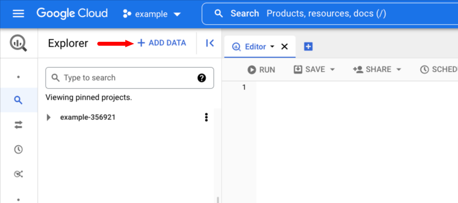
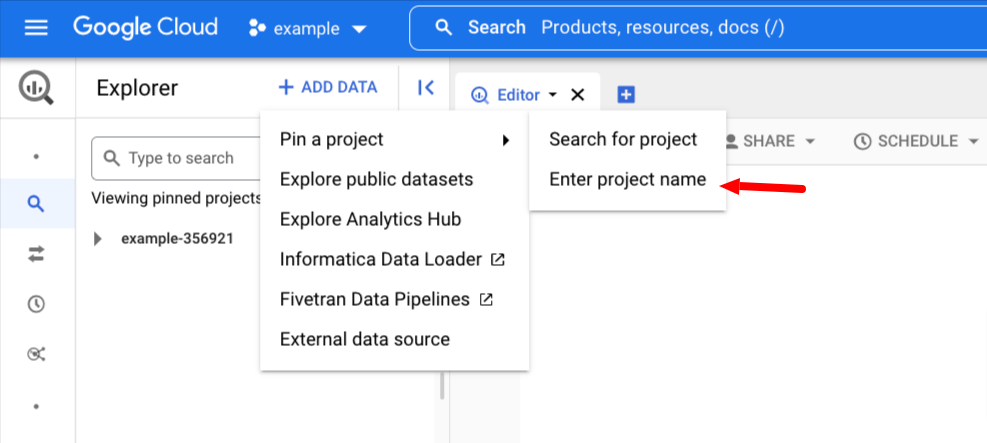
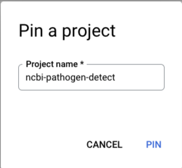
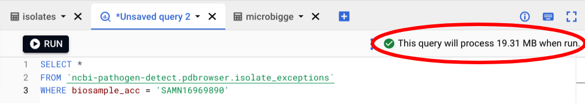
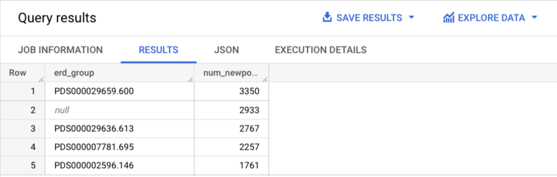

Project 1: Use BigQuery to search MicroBIGG-E and Isolates data
===============================================================
<!-- Generate toc with https://ecotrust-canada.github.io/markdown-toc/ -->

## Introduction

[BigQuery](https://cloud.google.com/bigquery/) is a distributed SQL-based database where NCBI Pathogen Detection provides direct access to the data behind the [Pathogen Detection Isolates Browser](https://www.ncbi.nlm.nih.gov/pathogens/isolates/) and [MicroBIGG-E](https://www.ncbi.nlm.nih.gov/pathogens/microbigge/). We have more details in the documentation for [Isolates Browser data at Google Cloud Platform](https://www.ncbi.nlm.nih.gov/pathogens/docs/isolates_gcp/) and [MicroBIGG-E data at Google Cloud Platform](https://www.ncbi.nlm.nih.gov/pathogens/docs/microbigge_gcp/).

For this project we will use the [BigQuery console](https://console.cloud.google.com/bigquery?project=ncbi-asm-ngs-workshop) to run queries and examine output, in [Project 2](Project-3) we'll use the [`bq` command-line tool](https://cloud.google.com/bigquery/docs/bq-command-line-tool) which is another way of querying the BigQuery database. 

Note that BigQuery charges by amount of data processed, so under normal (non-workshop) circumstances you will be responsible for covering any charges for data access using BigQuery. Google provides for 1 Tb of free processing per month and for most purposes that should be more than enough. Even if you were over that limit a full table scan of our largest MicroBIGG-E table should cost under $2.00, and the queries shown below will cost well under that.

# Background

## Isolates Browser
The Pathogen Detection Isolates Browser is a table-based view of the over 1,000,000 isolate genomes in the Pathogen Detection system. In this view every row is an isolate and every column information about that isolate either provided by the submitter or calculated by the NCBI Pathogen Detection System. See our [Isolates Browser documentation](https://www.ncbi.nlm.nih.gov/pathogens/pathogens_help/#isolates-browser) for more information.

We provide Isolates Browser data in two tables, `ncbi-pathogen-detect.pdbrowser.isolates` and `ncbi-pathogen-detect.pdbrowser.isolate_exceptions`. 

The `ncbi-pathogen-detect.pdbrowser.isolates` (`isolates`) table contains information on all isolates that have been processed through the pipeline, while the `ncbi-pathogen-detect.pdbrowser.isolate_exceptions` (`isolate_exceptions`) provides information on isolates that entered the pipeline, but failed to process cleanly, usually because of failures in QC checks.

## MicroBIGG-E (Microbial Browser for Identification of Genetic and Genomic Elements)

MicroBIGG-E contains the results of running [AMRFinderPlus](https://www.ncbi.nlm.nih.gov/pathogens/antimicrobial-resistance/AMRFinder/) on isolate assemblies and annotations analyzed by the Pathogen Detection System once they have been deposited in GenBank. Because there is some delay caused by the GenBank submission process and some constrains on what GenBank will allow, not all assemblies in the Isolates Browser will have results in MicroBIGG-E. See our [MicroBIGG-E documentation](https://www.ncbi.nlm.nih.gov/pathogens/pathogens_help/#microbigge) for more details.

## BigQuery Cloud Console

Google provides the [BigQuery cloud console](https://cloud.google.com/bigquery/docs/bigquery-web-ui) as an easy interface to work with BigQuery tables. We have a [Getting started with BigQuery](https://www.ncbi.nlm.nih.gov/pathogens/docs/getting_started_bigquery/) page with pointers on how to use it in your own projects/accounts.

# Exercises

## Exercise 1: Connect to BigQuery and examine tables

Go to the [BigQuery console](https://console.cloud.google.com/bigquery?project=ncbi-asm-ngs-workshop) and pin the project.

First click __+ ADD DATA__<br />


Then mouse over __Pin a Project__ and click __Enter project name__ <br />


And fill in `ncbi-pathogen-detect` <br />


Click the triangles and take a look at the tables using the interface. 

<!-- make sure people pin the query -->

## Exercise 2: Examine tables and compare to web interface

Click the triangles to show the tables and click on the tables to see the structure and some example contents.

Check out the web interfaces for the browsers.

- Isolates: <https://www.ncbi.nlm.nih.gov/pathogens/isolates/#SAMN11101132>
    - One isolate assembly per row.
- Isolates exceptions: <https://www.ncbi.nlm.nih.gov/pathogens/isolates/#SAMEA7320135>
    - One isolate assembly per row.
- MicroBIGG-E: <https://www.ncbi.nlm.nih.gov/pathogens/microbigge>
    - One gene or point mutation per row.

### Isolate_exceptions

Isolate exceptions only appear in the [Isolates Browser](https://www.ncbi.nlm.nih.gov/pathogens/isolates/) web interface when one of the search identifiers is included in the table. An example is [SAMEA7320135](https://www.ncbi.nlm.nih.gov/pathogens/isolates/#SAMEA7320135) which has an assembly that doesn't meet the minimum quality metrics for analysis in the PD pipeline. 

Try this query in the console and you can see the same exception information using BigQuery:

#### Query 1: Find isolate in `isolate_exceptions`
```sql
SELECT *
FROM `ncbi-pathogen-detect.pdbrowser.isolate_exceptions`
WHERE biosample_acc = 'SAMEA7320135'
```

Notice that in the upper right there is an estimate of how much data this query
will process. BigQuery is a column based database, and the charges are based on
how much data is scanned, which depends on which columns are included in the
query. Using fewer columns will incur less cost. That 19 Mb costs about
0.019 cents at the current rates.



And find out a little more using the `isolates` table.

#### Query 2: Find isolate in `isolates`
```sql
SELECT taxgroup_name, isolate_identifiers, serovar, serotype, erd_group, computed_types
FROM `ncbi-pathogen-detect.pdbrowser.isolates`
WHERE biosample_acc = 'SAMN11101132'
```

#### Query 3: Results for isolate in `microbigge` 
```sql
SELECT element_symbol, element_name, subclass
FROM `ncbi-pathogen-detect.pdbrowser.microbigge`
WHERE biosample_acc = 'SAMN30626382'
```

## Exercise 3: More SQL queries

### `isolates`

See our [documentation](https://www.ncbi.nlm.nih.gov/pathogens/docs/isolates_gcp/) for more details and examples.

#### Query 4: Find the AMR genes from an isolate of interest

```sql
SELECT biosample_acc, asm_acc, target_acc, mindiff, AMR_genotypes,
    stress_genotypes, virulence_genotypes, computed_types
FROM `ncbi-pathogen-detect.pdbrowser.isolates`
WHERE biosample_acc = 'SAMN08848639'
```

Take a look at the complex fields `AMR_genotypes`, `stress_genotypes`, `virulence_types`, and `computed_types`. Note how they have multiple subfields and some have multiple rows for a single row in `isolates`.

#### Query 5: Find all Salmonella Newport isolates

```sql
SELECT target_acc, biosample_acc, erd_group, computed_types
FROM `ncbi-pathogen-detect.pdbrowser.isolates`
WHERE computed_types.serotype = 'Newport'
AND taxgroup_name LIKE 'Salmonella%'
```
You should get around 32,434 isolates that were typed as Newport by SeqSero2. The number may vary because this is live data.

#### Query 6: Find the most common SNP clusters for Salmonella Newport isolates

The following query will select the 5 SNP clusters with the most isolates typed as Newport by SeqSero2. Now we're getting to slightly more complex SQL. Here we use the `GROUP BY` clause and `count()` function to count the numbers of rows. Also notice that we search the field `computed_types.serotype` to get at the contents of the subfield. 

```sql
SELECT erd_group, count(*) num_newport_isolates
FROM `ncbi-pathogen-detect.pdbrowser.isolates`
WHERE computed_types.serotype = 'Newport'
    AND taxgroup_name LIKE 'Salmonella%'
GROUP BY erd_group
ORDER BY num_newport_isolates DESC
LIMIT 5
```

You should see something like: <br />

Note that the 2nd most common cluster is _null_. Those are isolates that did not cluster with other isolates in our system above the wgMLST thresholds.

#### Query 7: Find isolates that are carbapenem resistant but don't have a KPC or NDM beta-lactamase

Here we search the complex fields `AST_phenotypes` and `AMR_genotypes` using the `UNNEST()` function and subqueries.


```sql
SELECT target_acc 
FROM `ncbi-pathogen-detect.pdbrowser.isolates` isolates
WHERE
(SELECT COUNT(1)
  FROM UNNEST(isolates.AST_phenotypes) 
  WHERE antibiotic LIKE '%penem' AND phenotype = 'resistant'
) >= 1
AND
(SELECT COUNT(1)
  FROM UNNEST(isolates.AMR_genotypes)
  WHERE element LIKE 'blaKPC%' OR element LIKE 'blaNDM%'
) = 0
```

### `microbigge`

See our [documentation](https://www.ncbi.nlm.nih.gov/pathogens/docs/microbigge_gcp/) for more details and examples. Since we've already covered the basics we'll start out with some slightly more complicated queries for the `microbigge` table.

#### Query 8: Find the five most common AMR genes associated with quinolone resistance

```sql
SELECT element_symbol, subclass, count(*) num_found
FROM `ncbi-pathogen-detect.pdbrowser.microbigge`
WHERE subclass like '%QUINOLONE%'
AND   subtype = 'AMR'
GROUP BY element_symbol, subclass
ORDER BY num_found DESC
LIMIT 5
```

#### Query 9: Find contigs with both blaKPC-2 and blaTEM-1 genes in MicroBIGG-E

Here we do a self-join within `microbigge` to get all contigs that have both blaTEM-1 and blaKPC-2 on the same contig

```sql
SELECT DISTINCT mb1.contig_acc, mb1.scientific_name
FROM
    `ncbi-pathogen-detect.pdbrowser.microbigge` mb1
    JOIN `ncbi-pathogen-detect.pdbrowser.microbigge` mb2
        ON mb1.element_symbol = 'blaTEM-1'
            AND mb1.contig_acc = mb2.contig_acc
            AND mb2.element_symbol = 'blaKPC-2'
```

#### Query 10: Find elements on contigs that have both blaKPC-2 and blaTEM-1 genes in MicroBIGG-E

Making Query 8 a sub-query we can get all elements on contigs that have both blaTEM-1 and blaKPC-2 in order of their start coordinate.

```sql
SELECT
    mb.contig_acc,
    mb.element_symbol,
    mb.scientific_name
FROM
    `ncbi-pathogen-detect.pdbrowser.microbigge` mb
    JOIN ( SELECT DISTINCT
            mb1.contig_acc
        FROM
            `ncbi-pathogen-detect.pdbrowser.microbigge` mb1
            JOIN `ncbi-pathogen-detect.pdbrowser.microbigge` mb2 
                ON mb1.element_symbol = 'blaTEM-1'
                    AND mb1.contig_acc = mb2.contig_acc
                    AND mb2.element_symbol = 'blaKPC-2') contigs 
        ON contigs.contig_acc = mb.contig_acc
ORDER BY
    mb.contig_acc,
    mb.start_on_contig
```

### Bonus round

#### Query 11: Find all clusters where >75% have a blaKPC

This is the first query where we're using a JOIN, and it does something that couldn't be done with the web interface. 

```sql
SELECT kpc_count.erd_group, round(kpc_count.num / erd_size.num * 100) as pct_with_kpc, 
    erd_size.num as snp_cluster_size, kpc_count.scientific_name
FROM
  (SELECT erd_group, count(*) num, scientific_name
      FROM `ncbi-pathogen-detect.pdbrowser.isolates`
      WHERE (
        (SELECT COUNT(1)
        FROM UNNEST(AMR_genotypes) AS AMR_genotypes
        WHERE element LIKE 'blaKPC%'
        ) >= 1
      )
      GROUP BY erd_group, scientific_name
  ) kpc_count
  LEFT JOIN
    (SELECT erd_group, count(*) num
      FROM `ncbi-pathogen-detect.pdbrowser.isolates`
      GROUP BY erd_group
    ) erd_size
  ON kpc_count.erd_group = erd_size.erd_group
WHERE
  kpc_count.num / erd_size.num > 0.75
ORDER BY
  pct_with_kpc DESC, snp_cluster_size DESC
```

#### Query 12: Join with the MicroBIGG-E table to find isolates that are carbapenem resistant but don't have a known carbapenem resistance gene or allele

Here we join across two tables `isolates` and `microbigge` to take advantage of the unique data they have in each. This is also something that could not be done using the web interface alone.

```sql
SELECT isolates.target_acc,
  ARRAY(select AS STRUCT antibiotic, phenotype from UNNEST(AST_phenotypes) WHERE  antibiotic LIKE "%penem") AST
FROM `ncbi-pathogen-detect.pdbrowser.isolates` isolates
LEFT JOIN `ncbi-pathogen-detect.pdbrowser.microbigge` microbigge
  ON isolates.target_acc = microbigge.target_acc
  AND microbigge.subclass = 'CARBAPENEM' -- Only carbapenem genes / point mutations
WHERE
  (SELECT count(1) FROM unnest(AST_phenotypes) AS ast
    WHERE antibiotic like "%penem" AND phenotype = 'resistant') >= 1
  AND isolates.amrfinderplus_version IS NOT NULL -- AMRFinderPlus was run on this target
  AND isolates.asm_acc IS NOT NULL -- AMRFinderPlus results should be in MicroBIGG-E because assembly is public
  AND microbigge.subclass IS NULL -- There are no rows in MicroBIGG-E with subclass = CARBAPENEM
ORDER BY isolates.target_acc
```

This query reveals unexplained resistance to carbapenems. Researchers can use
this information to investigate and characterize new mechanisms of resistance,
publish them, and we can add them to AMRFinderPlus. Hopefully this virtuous
cycle will lead the number of unexplained resistances to go down over time.

--------------------------------------------------
## End of Project 1

Continue to [Project 2](Project-2)
