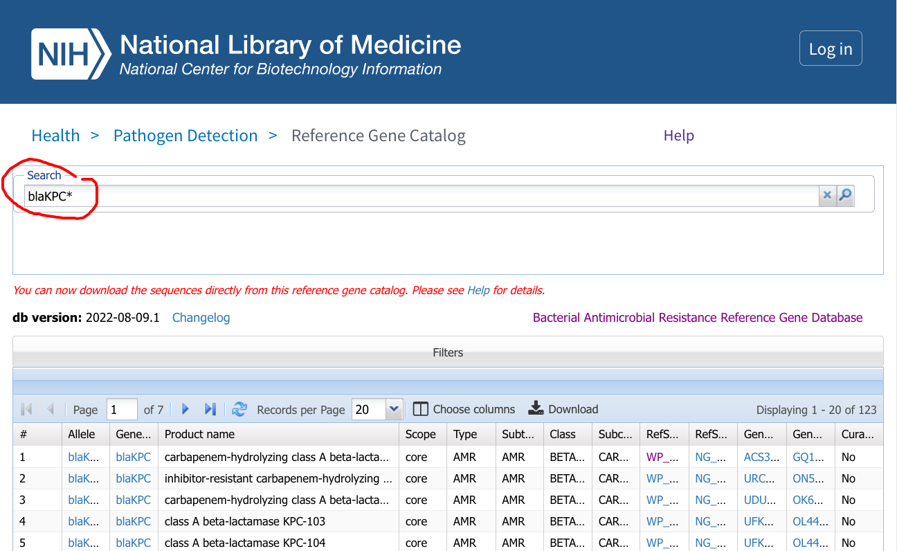
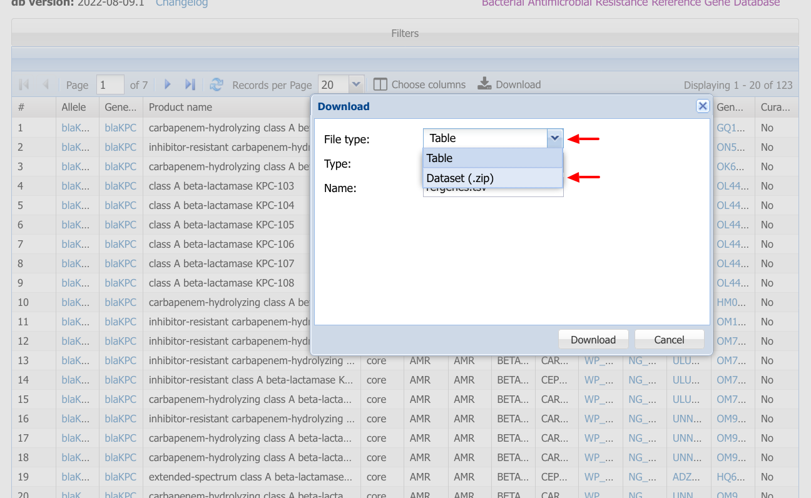
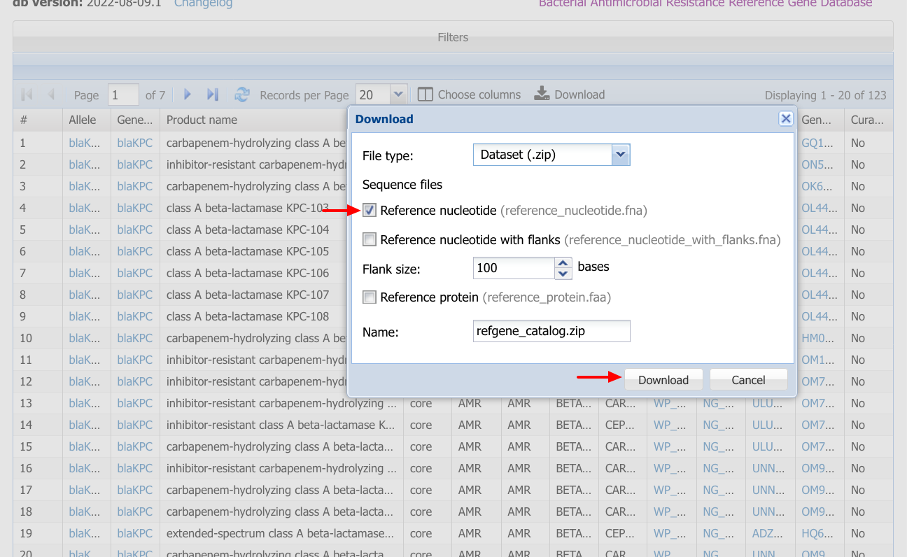
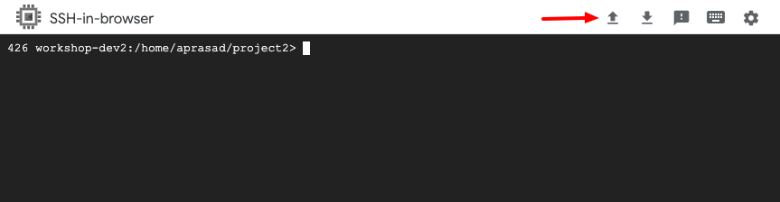
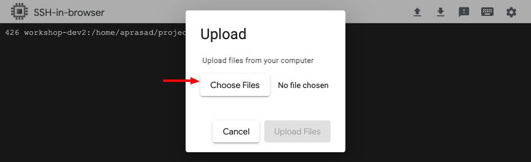

### Step 1b: Use your web browser to search for KPC alleles in the Reference Gene Catalog

Go to https://www.ncbi.nlm.nih.gov/pathogens/refgene/ and search for `blaKPC*`.



[Direct link](https://www.ncbi.nlm.nih.gov/pathogens/refgene/#blaKPC*)

### Step 1c: Download FASTA file of reference coding sequences

Click "Download" and select "__File type: Dataset__".



Then make sure "__Reference nucleotide__" is selected and click Download.



### Step 1d: Upload the datasets file to the VM

Click the upload button to upload the .zip file to the VM



Then click "__Select files__" and upload the `refgene_catalog.zip` file you downloaded from the Reference Gene Catalog.



__If the above didn't work, run the following to copy the refgene_catalog.zip file from a google bucket__

```shell
gsutil cp gs://asm-ngs-2022/project2/refgene_catalog.zip .
```

### Step 1e: Move the datasets package and extract the FASTA file

```shell
mv ~/refgene_catalog.zip ./
unzip refgene_catalog.zip
mv ncbi_dataset/data/nucleotide.fna ./kpc_cds.fna
```
