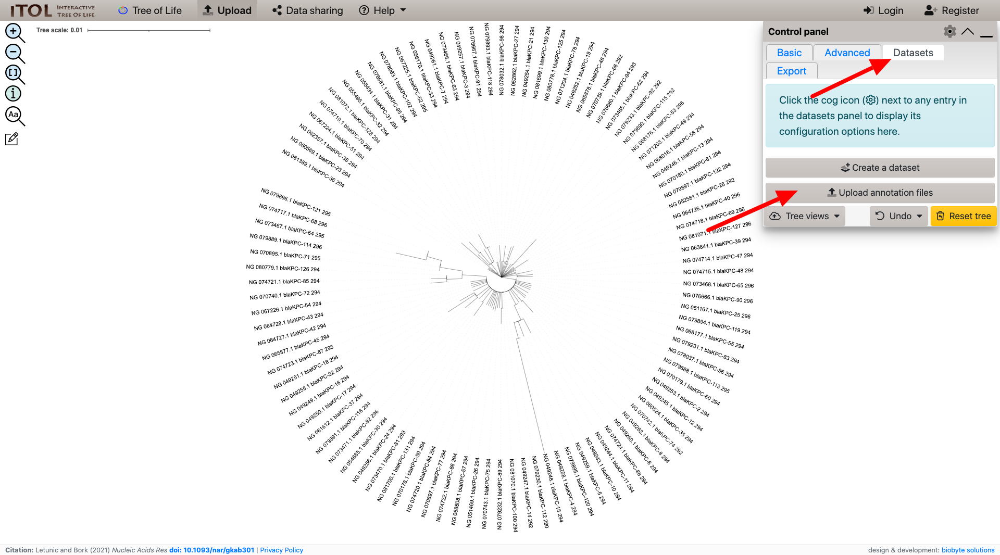
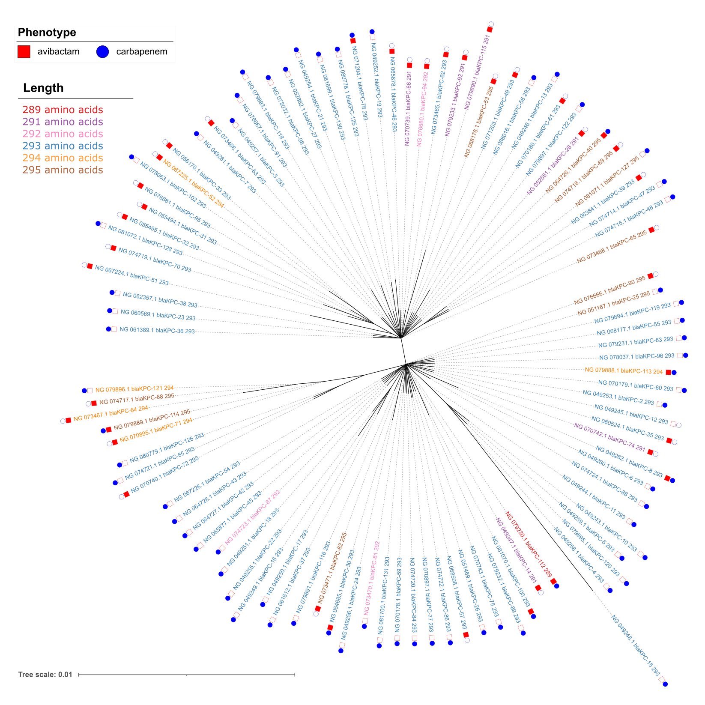

Project 2: Generate tree of KPC alleles to examine evolution of size variants
=============================================================================
<!-- TOC generated with https://ecotrust-canada.github.io/markdown-toc/ -->

## Some background

blaKPC genes are beta-lactamases that can hydrolize cabapenems, which are
last-line beta-lactam drugs. Though very closely related there are functional
differences in substrate specificity and avibactam resistance.


<!-- Adapted from https://confluence.ncbi.nlm.nih.gov/display/PD/KPC+family+phylogeny -->

## Step 1: Download FASTA file of all blaKPC alleles from the Reference Gene Catalog

For this project we're going to be working in the web console we already opened. If you have closed it you need to click the '__SSH__' link next to the listing for your VM in the [Compute Engine VM instances](https://console.cloud.google.com/compute/instances?project=ncbi-asm-ngs-workshop) list.

### Step 1a: Make a working directory
```shell
mkdir -p ~/project2
cd ~/project2
```

### Step 1b: Download the reference coding sequence from the AMRFinderPlus database

The AMRFinderPlus database contains a specially formatted FASTA file that includes the 
coding sequence for all the genes in the Reference Gene Catalog. You can also download 
the coding sequence from the 
[Reference Gene Catalog web interface](https://www.ncbi.nlm.nih.gov/pathogens/pathogens_help/#refgene-access-download).

```shell
wget https://ftp.ncbi.nlm.nih.gov/pathogen/Antimicrobial_resistance/AMRFinderPlus/database/latest/AMR_CDS
```

## Step 2: Filter for sequences less than 297 amino-acids in length

There are a few KPC alleles with large insertions that we will exclude in this analysis to simplify demonstrationa and analysis.

### Step 2a: Download the Reference Gene Catalog table

The data behind the [Reference Gene Catalog](https://www.ncbi.nlm.nih.gov/pathogens/refgene/) is available on our FTP site at <https://ftp.ncbi.nlm.nih.gov/pathogen/Antimicrobial_resistance/AMRFinderPlus/database/latest/ReferenceGeneCatalog.txt>.  We have documentation for the files in the AMRFinderPlus database on [the AMRFinderPlus wiki](https://github.com/ncbi/amr/wiki/AMRFinderPlus-database#files)

```shell
wget https://ftp.ncbi.nlm.nih.gov/pathogen/Antimicrobial_resistance/AMRFinderPlus/database/latest/ReferenceGeneCatalog.txt
```

### Step 2b: Get a list of blaKPC genes < 297 amino-acids in length

We'll use `awk` to calculate the length of each element in nucleotide space and filter for those less than 297 amino acids (`genbank_stop` - `genbank_start` + 1 < 297).  For those lines that match we'll print out the `refseq_accession`, `allele`, and the length in amino-acids.

```shell
awk -F'\t' '$2 == "blaKPC" && ($20-$19+1)/3 < 297 { print $11"\t"$1"\t"($20-$19+1)/3-1 }' ReferenceGeneCatalog.txt > kpc_to_analyze.tab
```

`kpc_to_analyze.tab` is in the format `accession` \<tab\> `allele` \<tab\> `length`

### Step 2c: Filter and reformat the FASTA

Filter the FASTA file for the sequences we're interested in and make convenient phylip-compatible names for visualizing on a phylogenetic tree.

```shell
time while read -u 10 accession allele length
do
    seqkit grep -r -p "$accession" AMR_CDS | 
        sed "s/^>.*/>${accession}_${allele}_${length}/"
done 10< kpc_to_analyze.tab > kpc_to_analyze.fna
```

## Step 3: Align the sequences with Muscle

```shell
muscle -align kpc_to_analyze.fna -output kpc_to_analyze.aln.fna
```

This step should take a couple of minutes.

```
muscle -align kpc_to_analyze.fna -output kpc_to_analyze.aln.fna

muscle 5.1.linux64 [12f0e2]  32.9Gb RAM, 8 cores
Built Jan 13 2022 23:17:13
(C) Copyright 2004-2021 Robert C. Edgar.
https://drive5.com

Input: 100 seqs, avg length 882, max 888

00:00 4.6Mb  CPU has 8 cores, running 8 threads
01:57 541Mb   100.0% Calc posteriors
01:59 554Mb   100.0% Consistency (1/2)
02:01 554Mb   100.0% Consistency (2/2)
02:01 554Mb   100.0% UPGMA5
02:03 565Mb   100.0% Refining
```

## Step 4: Infer the tree using RAxML

```shell
raxml-ng --search --msa kpc_to_analyze.aln.fna --model GTR+I+G --seed 1 --redo
```

The end of the output from RAxML-NG run should look something like this:

```
Best ML tree with collapsed near-zero branches saved to: /home/aprasad/project2/kpc_to_analyze.aln.fna.raxml.bestTreeCollapsed
Best ML tree saved to: /home/aprasad/project2/kpc_to_analyze.aln.fna.raxml.bestTree
All ML trees saved to: /home/aprasad/project2/kpc_to_analyze.aln.fna.raxml.mlTrees
Optimized model saved to: /home/aprasad/project2/kpc_to_analyze.aln.fna.raxml.bestModel

Execution log saved to: /home/aprasad/project2/kpc_to_analyze.aln.fna.raxml.log

Analysis started: 21-Sep-2022 18:02:17 / finished: 21-Sep-2022 18:02:56

Elapsed time: 39.329 seconds
```

## Step 5: Visualize the tree in iTOL

We're using the web-based software [iTOL](https://itol.embl.de/) for this exercise, an alternative to using iTOL to visualize the tree is NCBI's desktop GUI software [Genome Workbench](https://www.ncbi.nlm.nih.gov/tools/gbench/manual1/).

### Step 5a: Copy and paste into iTOL

```shell
cat kpc_to_analyze.aln.fna.raxml.bestTree
```
Copy the text of the tree.


Your tree should look like, if you don't use or change the `--seed` option above the tree might vary because of differences in the random numbers used by RAxML-NG:

```
((((NG_073466.1_blaKPC-63_293:0.001298,NG_049261.1_blaKPC-7_293:0.001286):0.000001,(((NG_076667.1_blaKPC-91_293:0.000001,NG_079893.1_blaKPC-118_293:0.001293):0.001334,(((NG_081699.1_blaKPC-130_293:0.001298,(NG_071204.1_blaKPC-78_293:0.001311,NG_080778.1_blaKPC-125_293:0.000001):0.001309):0.000001,(NG_049252.1_blaKPC-19_293:0.002706,(NG_065878.1_blaKPC-46_293:0.001300,(((NG_073465.1_blaKPC-62_293:0.001304,(NG_079890.1_blaKPC-115_291:0.002847,NG_079233.1_blaKPC-92_291:0.000001):0.001353):0.000001,NG_076680.1_blaKPC-94_292:0.000001):0.000001,NG_070739.1_blaKPC-66_291:0.000001):0.000001):0.000001):0.000001):0.000001,(NG_078032.1_blaKPC-98_293:0.001285,(NG_049254.1_blaKPC-21_293:0.001310,NG_052862.1_blaKPC-27_293:0.000001):0.001300):0.000001):0.000001):0.000001,NG_049257.1_blaKPC-3_293:0.000001):0.000001):0.000001,((((NG_074718.1_blaKPC-69_295:0.001284,(((NG_074715.1_blaKPC-48_293:0.001289,NG_074714.1_blaKPC-47_293:0.001287):0.000001,NG_063841.1_blaKPC-39_293:0.000001):0.000001,NG_081071.1_blaKPC-127_295:0.001282):0.001277):0.000001,(NG_064726.1_blaKPC-40_295:0.001286,NG_052581.1_blaKPC-28_291:0.000001):0.000001):0.000001,(NG_068176.1_blaKPC-53_295:0.000001,(((NG_079897.1_blaKPC-122_293:0.001285,NG_070180.1_blaKPC-61_293:0.001296):0.000001,NG_049246.1_blaKPC-13_293:0.002597):0.000001,(NG_068016.1_blaKPC-56_293:0.001286,NG_071203.1_blaKPC-49_293:0.001295):0.000001):0.000001):0.000001):0.000001,((NG_076666.1_blaKPC-90_295:0.000001,(NG_051167.1_blaKPC-25_295:0.000001,(NG_079894.1_blaKPC-119_293:0.001310,(NG_068177.1_blaKPC-55_293:0.001325,(NG_079231.1_blaKPC-83_293:0.001311,(((((((((((NG_070743.1_blaKPC-75_293:0.001308,(((((((((NG_073471.1_blaKPC-82_295:0.000001,(NG_079891.1_blaKPC-116_293:0.001308,((((NG_065877.1_blaKPC-45_293:0.001320,((((((NG_080779.1_blaKPC-126_293:0.000001,NG_074721.1_blaKPC-85_293:0.001284):0.000001,NG_070740.1_blaKPC-72_293:0.001311):0.001257,(NG_070895.1_blaKPC-71_294:0.000001,((NG_073467.1_blaKPC-64_294:0.002546,(NG_079896.1_blaKPC-121_294:0.000001,NG_074717.1_blaKPC-68_295:0.000001):0.000001):0.001225,NG_079889.1_blaKPC-114_295:0.000001):0.000001):0.001879):0.001985,NG_067226.1_blaKPC-54_293:0.001310):0.000001,NG_064728.1_blaKPC-43_293:0.001318):0.000001,NG_064727.1_blaKPC-42_293:0.001318):0.000001):0.000001,NG_074723.1_blaKPC-87_292:0.000001):0.000001,NG_049251.1_blaKPC-18_293:0.001310):0.000001,(((NG_049255.1_blaKPC-22_293:0.001336,NG_049249.1_blaKPC-16_293:0.002643):0.000001,NG_049250.1_blaKPC-17_293:0.000001):0.000001,NG_061612.1_blaKPC-37_293:0.001329):0.001318):0.000001):0.000001):0.000001,(NG_054685.1_blaKPC-30_293:0.000001,NG_049256.1_blaKPC-24_293:0.001319):0.001309):0.000001,NG_073470.1_blaKPC-81_292:0.000001):0.000001,NG_081700.1_blaKPC-131_293:0.001318):0.000001,NG_070178.1_blaKPC-59_293:0.001311):0.000001,NG_074720.1_blaKPC-84_293:0.001335):0.000001,NG_070897.1_blaKPC-77_293:0.001380):0.000001,(NG_074722.1_blaKPC-86_293:0.001028,NG_068508.1_blaKPC-57_293:0.001088):0.000518):0.000001,NG_051469.1_blaKPC-26_293:0.001310):0.000001):0.000001,(NG_079230.1_blaKPC-112_289:0.000001,(NG_049247.1_blaKPC-14_291:0.000001,(NG_079232.1_blaKPC-89_293:0.001285,NG_081070.1_blaKPC-100_293:0.000001):0.001303):0.000001):0.000001):0.000001,((NG_049243.1_blaKPC-10_293:0.001307,(((NG_049248.1_blaKPC-15_293:0.009645,NG_049258.1_blaKPC-4_293:0.000001):0.001337,NG_079895.1_blaKPC-120_293:0.001313):0.000001,NG_049259.1_blaKPC-5_293:0.000001):0.000001):0.001314,NG_049244.1_blaKPC-11_293:0.000001):0.001305):0.000001,NG_074724.1_blaKPC-88_293:0.001310):0.000001,((NG_049260.1_blaKPC-6_293:0.000001,NG_049262.1_blaKPC-8_293:0.001326):0.001332,NG_070742.1_blaKPC-74_291:0.000001):0.000001):0.000001,NG_060524.1_blaKPC-35_293:0.001326):0.000001,NG_049245.1_blaKPC-12_293:0.001320):0.000001,NG_049253.1_blaKPC-2_293:0.000001):0.000001,NG_070179.1_blaKPC-60_293:0.001310):0.000001,NG_079888.1_blaKPC-113_294:0.000001):0.000001,NG_078037.1_blaKPC-96_293:0.001330):0.000001):0.000001):0.000001):0.000001):0.000001):0.001211,NG_073468.1_blaKPC-65_295:0.000001):0.000001):0.000001):0.000001,((NG_067224.1_blaKPC-51_293:0.003867,((NG_055494.1_blaKPC-31_293:0.000001,(NG_076681.1_blaKPC-95_293:0.001259,((NG_056170.1_blaKPC-33_293:0.000001,NG_067225.1_blaKPC-52_294:0.000001):0.000001,NG_078063.1_blaKPC-102_293:0.001304):0.001275):0.000001):0.000001,(NG_074719.1_blaKPC-70_293:0.001267,(NG_055495.1_blaKPC-32_293:0.000001,NG_081072.1_blaKPC-128_293:0.001258):0.001255):0.000001):0.000954):0.000458,NG_062357.1_blaKPC-38_293:0.001293):0.000001,(NG_060569.1_blaKPC-23_293:0.001299,NG_061389.1_blaKPC-36_293:0.001295):0.000001);
```

Go go iTOL at __<https://itol.embl.de/upload.cgi>__ and copy and paste your tree into the upload box.

You can see your tree, but we'll add an annotation file to color branches so we can see the length variation more easily.

### Step 5b: Download and add iTOL annotation files.

There are two annotation files we used to add color and phenotype information
to the tree at iTOL. Documentation for the annotation file formats at iTOL is [here](https://itol.embl.de/help.cgi#annot). 

Here are the two annotation files we've already generated. Right click each of them and save them for upload to iTOL.

<!-- use HTML links because we want to force download -->
- <a href="tree_colors.txt" download="tree_colors.txt">tree_colors.txt</a>
- <a href="phenotype_annotation.txt" download="phenotype_annotation.txt">phenotype_annotation.txt</a>

To save time we've run them already and link to them here, but the following
commands will generate them live from your data.  You can also take a look at
the two quick-and-dirty scripts to generate the annotation files: [make_tree_colors.pl](https://github.com/ncbi/workshop-asm-ngs-2022/blob/master/scripts/make_tree_colors.pl) and [annotate_phenotypes.pl](https://github.com/ncbi/workshop-asm-ngs-2022/blob/master/scripts/annotate_phenotypes.pl).

```shell
wget https://raw.githubusercontent.com/wiki/ncbi/workshop-asm-ngs-2022/make_tree_colors.pl
perl make_tree_colors.pl kpc_to_analyze.tab > tree_colors.txt
wget https://raw.githubusercontent.com/wiki/ncbi/workshop-asm-ngs-2022/annotate_phenotypes.pl
perl annotate_phenotypes.pl ReferenceGeneCatalog.txt > phenotype_annotation.txt
```

<!--

Download a short perl script to generate the annotation file.

```shell
wget https://raw.githubusercontent.com/wiki/ncbi/workshop-asm-ngs-2022/make_tree_colors.pl
```

Check out the [script contents](https://raw.githubusercontent.com/wiki/ncbi/workshop-asm-ngs-2022/make_tree_colors.pl).

### Step 5c: Run `make_tree_colors.pl` to get an annotation file for iTOL

```shell
perl make_tree_colors.pl kpc_to_analyze.tab > kpc_itol_annotation.txt
```

### Step 5d: Download the iTOL file

First get the path

```shell
echo $HOME/project2/kpc_itol_annotation.txt
```

Copy the output of that command (e.g.,: `/home/aprasad/project2/kpc_itol_annotation.txt`)

Click the download icon in the upper right of the terminal window and paste in the path you copied above.

If that's not working download it directly from here: [kpc_itol_annotation.txt](kpc_itol_annotation.txt)

-->

### Step 5c: Upload the annotation file to color the taxon names

Click the "__Datasets__" tab in iTOL and then the "__Upload annotation files__" button.


Select the [`tree_colors.txt`](tree_colors.txt) and [`phenotype_annotation.txt`](phenotype_annotation.txt) files you already downloaded and click upload.

## Discussion



Three conclusions:

1. "Star topology" indicates a recent radiation from ancestor sequence with little resolution in the tree. Little data to verify exact branching pattern.
2. Likely multiple independent mutational events leading to size differences.
3. Some phenotypes have not been assessed experimentally and that could be a source of inconsistency.

---------------------------------------------
## End of Project 2

Continue on to [Project 3](Project-3)

