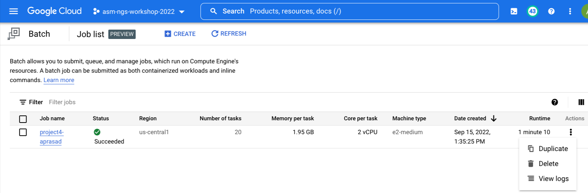

# Project 3: Selection analysis on 293-aa blaKPC genes

## Background

BlaKPC is an important resistance gene to carbapenemases which are a family of beta-lactamases that are usually used as the last-line of defense to highly resistant organisms.  
The most common blaKPC allele is blaKPC-2, which is a 293 amino acid protein that we find in about 17,000 isolates in the Pathogen Detection system.
Insertions near the Omega loop are known to affect substrate binding and phenotype, but to our knowledge publications have not come out investigating positive selection on amino-acid substitutions in blaKPC.
Here we look at all the 293-aa blaKPC genes in MicroBIGG-E to see if we can find sites under positive selection in this enzyme.


## Step 1: Get a list of contigs with sequences of interest

### Step 1a: Create a working directory for this project

```shell
mkdir -p ~/project3
cd ~/project3
```

### Step 1b: Use BigQuery to get a list of contigs with KPC genes

```shell
bq query --use_legacy_sql=false --max_rows 50000 '
SELECT contig_acc, contig_url, start_on_contig, end_on_contig, strand, element_symbol
FROM `ncbi-pathogen-detect.pdbrowser.microbigge`
WHERE element_symbol LIKE "blaKPC%"
AND element_length = 293
AND amr_method IN ("EXACTX", "EXACTP", "ALLELEX", "ALLELEP", "BLASTX", "BLASTP")
' > 293aa_kpc_contigs.out
```

Lets take a look at the results

```shell
head 293aa_kpc_contigs.out
```

```
+----------------------+----------------------------------------------------------------------------------------------+-----------------+---------------+--------+----------------+
|      contig_acc      |                                          contig_url                                          | start_on_contig | end_on_contig | strand | element_symbol |
+----------------------+----------------------------------------------------------------------------------------------+-----------------+---------------+--------+----------------+
| DAGJCA010000251.1    | gs://ncbi-pathogen-assemblies/Klebsiella/858/709/DAGJCA010000251.1.fna.gz                    |             152 |          1033 | +      | blaKPC         |
| DAGFMJ010000187.1    | gs://ncbi-pathogen-assemblies/Klebsiella/874/735/DAGFMJ010000187.1.fna.gz                    |             308 |          1189 | +      | blaKPC         |
| DAGAHK010000102.1    | gs://ncbi-pathogen-assemblies/Klebsiella/1019/705/DAGAHK010000102.1.fna.gz                   |           10658 |         11539 | +      | blaKPC         |
| DAFWJT010000348.1    | gs://ncbi-pathogen-assemblies/Klebsiella/1141/057/DAFWJT010000348.1.fna.gz                   |             165 |          1046 | +      | blaKPC         |
| DAJACB010000057.1    | gs://ncbi-pathogen-assemblies/Escherichia_coli_Shigella/1386/299/DAJACB010000057.1.fna.gz    |            7204 |          8085 | +      | blaKPC-3       |
| NZ_KL407350.1        | gs://ncbi-pathogen-assemblies/Klebsiella/33/733/NZ_KL407350.1.fna.gz                         |           26561 |         27442 | +      | blaKPC-3       |
| NZ_LAKK01000012.1    | gs://ncbi-pathogen-assemblies/Klebsiella/66/427/NZ_LAKK01000012.1.fna.gz                     |         3087593 |       3088474 | +      | blaKPC-3       |
```

We'll use the fact that the `contig_acc` matches the filename in the contig_url in [Step 3](#step-3-cut-out-coding-sequences) below.

### Step 1c: How many contigs are we looking at?

```shell
wc -l 293aa_kpc_contigs.out
```

```
25849 293aa_kpc_contigs.out
```

Number of lines minus the header and footer 
25,849 - 4 = 25,845 contigs

It's not too large a number so we don't have to worry that much about performance, though we will cut down one of the steps for the purposes of this course. Other parallelized approaches can be used for much larger datasets.

## Step 2: Prepare a Google Batch job to extract the coding sequences

We're using [Google Batch](https://cloud.google.com/batch/docs/get-started) to do this in parallel because it takes about 25 minutes to copy and extract all ~25,000 files onto the VM just using normal `gsutil` commands. If I were doing this normally I would probably just do that, but we're using Google Batch because as the number of sequences gets larger that time can get prohibitive. 

### Step 2a: Prepare lists of extraction jobs split into 20 jobs

In the [Setup](Setup) you should have created a bucket named `asmngs-$USER`. If not you can run `gsutil mb gs://asmngs-$USER` to create one.

```shell
mkdir joblist
# get the list of contigs to copy
fgrep 'gs://' 293aa_kpc_contigs.out | awk '{print $4}' | sort -u > contig_urls
# split them into 20 smaller lists
split -n 20 -d contig_urls joblist/contig_urls_
# copy the contig URL files to your bucket
gsutil -m cp -r joblist gs://asmngs-$USER/project3/joblist
gsutil cp 293aa_kpc_contigs.out gs://asmngs-$USER/project3/
```

### Step 2b: Create a script to extract a set of proteins from their contig files

This is the script that we will be running in parallel using Google Batch
```shell
cat <<'END' >> extract_cds.sh
#!/bin/bash

export PATH="$PATH:/snap/bin"

# get the job number
jobnum=$1
jobnum=$(( $jobnum + 1 ))
echo -n "Extracting CDS job number $jobnum"
echo "Running in $PWD"

# Get the path to the file containing the URLs for this job
contig_file_url=`gsutil ls gs://asmngs-USERNAMEHERE/project3/joblist | awk "NR==$jobnum{print}"`

# Copy that file to the current directory
gsutil cp $contig_file_url .

# Get the name of the file from the URL
contig_base=`basename $contig_file_url`

mkdir contigs

# first copy the files locally to process
cat $contig_base | gsutil -m cp -I contigs

for file in contigs/*
do
    contig=`basename $file .fna.gz`
    zcat $file | sed "s/^>.*/>$contig/"
done > contigs.fna

# Copy the SQL results and use them to create bed file of coordinates we want
# to cut out
gsutil cp gs://asmngs-USERNAMEHERE/project3/293aa_kpc_contigs.out .
fgrep -f $contig_base 293aa_kpc_contigs.out \
    | awk '{print $2"\t"$6-1"\t"$8"\t"$12"\t1\t"$10}' > kpc_cds.bed

# Extract the coding sequences
cat contigs.fna | seqkit subseq --bed kpc_cds.bed > kpc_cds.$contig_base.fna

# Copy the resulting file to the storage bucket
gsutil cp kpc_cds.$contig_base.fna gs://asmngs-USERNAMEHERE/project3
END

# change the script above to put in our username
perl -pi.bak -e "s/USERNAMEHERE/$USER/g" extract_cds.sh
```

To give Google batch access to this file we'll copy it to the bucket

```shell
chmod 755 extract_cds.sh
gsutil cp extract_cds.sh gs://asmngs-$USER/project3
```


### Step 2c: Prepare the Google Batch job .json file

#### Background

First some background on [Google Batch](https://cloud.google.com/batch/docs/get-started). Google Batch is a new product from Google Cloud designed to run batch-processing jobs in parallel. The model more closely matches the kinds of analysis pipelines often run in bioinformatics on Beowulf clusters. Unlike most of the other ways of running things in parallel it doesn't require you to program your job in a specific language, put the software in a Docker container, or manage a kubernetes cluster. I'm not sure, but it seems designed to fill the need of bioinformatic analysis pipelines. 

That said it is still a cloud product and there is some overhead to using it. To use Google Batch for our scientific pipelines we will need:

- A disk image with the software we need installed
    - For this project we'll just use the same one that we are using to work with since it has all the software we need already installed. To optimize for cost efficiency you can create a smaller more specialized image with just what you need on it, but this whole thing will only cost a couple of dollars at most so we're going for the simple solution of using an image we already know has the software we need and works.
- An "Instance template" that designates the virtual machine characteristics and the disk image to use to run the job
    - I've already created one for us to work from, but [here are instructions](Create-instance-template) to create your own.
- A Google Storage bucket for job inputs and outputs
    - Here we're using our `asmngs-$USER` bucket we created in the [Setup](Setup).
- A .json file with instructions of how to run the job

Here is an example .json file. Create it using the following command:

```shell
cat <<END > extract_cds.json
{
    "taskGroups":[
        {
        "taskSpec":{
            "runnables": [
            {
                "script": {
                "text": "bash /mnt/share/project3/extract_cds.sh \${BATCH_TASK_INDEX} 2>&1 > /mnt/share/project3/extract_cds.\${BATCH_TASK_INDEX}.out; echo Job \${BATCH_TASK_INDEX} Complete"
                }
            }
            ],
            "volumes": [
            {
                "gcs": {
                "remotePath": "asmngs-$USER"
                },
                "mountPath": "/mnt/share"
            }
            ]
        },
        "taskCount": 20
        }
    ],
    "allocationPolicy": {
        "instances": [
            {
                "instanceTemplate": "project3"
            }
        ]
    },
        "logsPolicy": {
        "destination": "CLOUD_LOGGING"
    }
}
END
```

##### A few notes on the values in this file

This block points to the script to run:
```json
            "runnables": [
            {
                "script": {
                "text": "bash /mnt/share/project3/extract_cds.sh"
                }
            }
            ],
```

This block tells Batch to mount the GS bucket `ncbi-$USER` to `/mnt/share`:
```json
            "volumes": [
            {
                "gcs": {
                "remotePath": "ncbi-$USER"
                },
                "mountPath": "/mnt/share"
            }
            ]
```

This directive says to run 20 jobs
```json
        "taskCount": 20
```

This directive says for Google batch to use the project3 Instance template to run the jobs.

```json
                "instanceTemplate": "project3"
```

## Step 3: Execute the batch job and collect the sequences

### Step 3a: Execute the Google Batch job

```shell
gcloud beta batch jobs submit project3-$USER --location us-central1 --config extract_cds.json
```

The output should look something like:
```
Job j-7880caf2-a019-499c-960a-41b9e7c8341b was successfully submitted.
allocationPolicy:
  instances:
  - instanceTemplate: project3
  location:
    allowedLocations:
    - zones/us-central1-a
    - zones/us-central1-b
    - zones/us-central1-c
    - zones/us-central1-f
createTime: '2022-09-22T15:52:40.877994657Z'
logsPolicy:
  destination: CLOUD_LOGGING
name: projects/ncbi-asm-ngs-workshop/locations/us-central1/jobs/project3-aprasad
status:
  runDuration: 0s
  state: QUEUED
taskGroups:
- name: projects/75612801392/locations/us-central1/jobs/project3-aprasad/taskGroups/group0
  parallelism: '20'
  taskCount: '20'
  taskSpec:
    computeResource:
      cpuMilli: '2000'
      memoryMib: '2000'
    runnables:
    - script:
        text: bash /mnt/share/project3/extract_cds.sh ${BATCH_TASK_INDEX} 2>&1 > /mnt/share/project3/extract_cds.${BATCH_TASK_INDEX}.out;
          echo Job ${BATCH_TASK_INDEX} Complete
    volumes:
    - gcs:
        remotePath: asmngs-aprasad
      mountPath: /mnt/share
uid: j-7880caf2-a019-499c-960a-41b9e7c8341b
updateTime: '2022-09-22T15:52:40.877994657Z'
```

### Step 3b: Check the status of the jobs

To list the batch jobs in the project use the following command. You will see an entry for all the jobs in the project including all of the other students. For the list below I'm just showing a single job, you will see more.

```shell
gcloud beta batch jobs list
```
```
NAME                                                                        LOCATION     STATE
projects/ncbi-asm-ngs-workshop/locations/us-central1/jobs/project3-aprasad  us-central1  SCHEDULED
```

The state 'SCHEDULED' means there are jobs currently being scheduled to run. If you go to the [VM instances](https://console.cloud.google.com/compute/instances?project=ncbi-asm-ngs-workshop) in the console you should see lots and lots of VMs with semi-random names like `j-eeb41d68-9089-4cfc-a6e5-3229a1254139-group0-0-0zwt`. 

#### More info about a job using `jobs describe`

You can get more info about jobs using the `gcloud beta batch jobs describe` command as below:

```bash
gcloud beta batch jobs describe projects/ncbi-asm-ngs-workshop/locations/us-central1/jobs/project3-$USER
```
```
allocationPolicy:
  instances:
  - instanceTemplate: project3
  location:
    allowedLocations:
    - zones/us-central1-a
    - zones/us-central1-b
    - zones/us-central1-c
    - zones/us-central1-f
createTime: '2022-09-22T15:52:40.877994657Z'
logsPolicy:
  destination: CLOUD_LOGGING
name: projects/ncbi-asm-ngs-workshop/locations/us-central1/jobs/project3-aprasad
status:
  runDuration: 0s
  state: SCHEDULED
  statusEvents:
  - description: Job state is set from QUEUED to SCHEDULED for job projects/75612801392/locations/us-central1/jobs/project3-aprasad.
    eventTime: '2022-09-22T15:52:44.760682489Z'
    type: STATUS_CHANGED
  taskGroups:
    group0:
      counts:
        PENDING: '20'
      instances:
      - machineType: e2-medium
        provisioningModel: STANDARD
        taskPack: '1'
taskGroups:
- name: projects/75612801392/locations/us-central1/jobs/project3-aprasad/taskGroups/group0
  parallelism: '20'
  taskCount: '20'
  taskSpec:
    computeResource:
      cpuMilli: '2000'
      memoryMib: '2000'
    runnables:
    - script:
        text: bash /mnt/share/project3/extract_cds.sh ${BATCH_TASK_INDEX} 2>&1 > /mnt/share/project3/extract_cds.${BATCH_TASK_INDEX}.out;
          echo Job ${BATCH_TASK_INDEX} Complete
    volumes:
    - gcs:
        remotePath: asmngs-aprasad
      mountPath: /mnt/share
uid: j-7880caf2-a019-499c-960a-41b9e7c8341b
updateTime: '2022-09-22T15:52:44.760682489Z'
```


### Step 3c: Web console

You can also check the status of the job using the Web console for Google Batch. Go to <https://console.cloud.google.com/batch/jobs> or use the console search to find "Batch" and you should see a list of all the batch jobs we've started and their status. You can see some (limited) information about them. Click the three dots to view the logs.



#### Check when done

From my experience the job should complete in about 5 minutes and you should see your job with STATE SUCCEEDED, for example:

```bash
gcloud beta batch jobs list
```
```
NAME                                                                        LOCATION     STATE
projects/ncbi-asm-ngs-workshop/locations/us-central1/jobs/project3-aprasad  us-central1  SUCCEEDED
```

## Step 4: Collect unique CDS sequences

### Step 4a: Copy the files over from the GS bucket

Once the Google Batch job has completed we will need to copy the sequences off of the bucket where the Google Batch job placed them.


```bash
gsutil cp gs://asmngs-$USER/project3/kpc_cds.contig_urls_*.fna .
```
```
...
Copying gs://asmngs-aprasad/project3/kpc_cds.contig_urls_19.fna...
\ [20 files][ 22.9 MiB/ 22.9 MiB]
Operation completed over 20 objects/22.9 MiB.
```

Before we move on lets confirm we have the number of sequences we expect

```bash
cat kpc_cds.contig_urls_??.fna | fgrep '>' | sort -u | wc -l
```
```
25607
```

### Step 4b: Combine the files and clean them up for analysis

This will:

1. Reformat the sequence identifier to be easier to read in downstream analysis (and phylip compatible)
2. Trim off a stop codon if it exists
3. Remove duplicate identical sequences so we're left with only unique sequences

```bash
cat kpc_cds.contig_urls_??.fna \
    | perl -pe 's/>(.*)_.*(blaKPC.*)/>$2_$1/' \
    | seqkit subseq -r 1:879 \
    | seqkit rmdup -s -D kpc.duplicate_list \
    > kpc_cds.fna
```
```
[INFO] 25466 duplicated records removed
```

How many unique CDS sequences do we have from the starting 25,162?

```shell
fgrep -c '>' kpc_cds.fna
```
```
141
```

## Step 5: Use RAxML to infer a tree

Note that all sequences are closely related and the same length so we will treat the FASTA file as an alignment. We need a tree to perform the FUBAR selection test below with HyPhy.

```shell
raxml-ng --search --msa-format FASTA --msa kpc_cds.fna --model GTR+I --redo
```

This step should take around a minute and you should see the following at the end:
```
Best ML tree with collapsed near-zero branches saved to: /home/aprasad/project3/kpc_cds.fna.raxml.bestTreeCollapsed
Best ML tree saved to: /home/aprasad/project3/kpc_cds.fna.raxml.bestTree
All ML trees saved to: /home/aprasad/project3/kpc_cds.fna.raxml.mlTrees
Optimized model saved to: /home/aprasad/project3/kpc_cds.fna.raxml.bestModel

Execution log saved to: /home/aprasad/project3/kpc_cds.fna.raxml.log

Analysis started: 15-Sep-2022 18:55:37 / finished: 15-Sep-2022 18:56:18

Elapsed time: 40.742 seconds
```

### Step 6: Run FUBAR test with HyPhy

We're going to use [HyPhy](http://hyphy.org/) to perform the [FUBAR](http://www.hyphy.org/w/index.php/FUBAR) (Fast, Unconstrained Bayesian AppRoximation for Inferring Selection) test of [Murrell et al. 2013](http://dx.doi.org/10.1093/molbev/mst030). In addition to running from the command-line as seen below there is a web server for HyPhy at <https://datamonkey.org> and a [GUI interface](http://hyphy.org) to run HyPhy on your own machine. 

__Need some additional background on FUBAR test__


```shell
hyphy fubar --alignment kpc_cds.fna --tree kpc_cds.fna.raxml.bestTree | tee kpc_cds.fubar
```

```
...
### Running an iterative zeroth order variational Bayes procedure to estimate the posterior mean of rate weights
* Using the following settings
	* Dirichlet alpha  : 0.5

### Tabulating site-level results
|     Codon      |   Partition    |     alpha      |      beta      |Posterior prob for positive selection|
|:--------------:|:--------------:|:--------------:|:--------------:|:-----------------------------------:|
|      212       |       1        |        0.708   |        6.537   |       Pos. posterior = 0.9126       |
|      239       |       1        |        1.100   |        7.172   |       Pos. posterior = 0.9228       |
----
## FUBAR inferred 2 sites subject to diversifying positive selection at posterior probability >= 0.9
Of these,  0.16 are expected to be false positives (95% confidence interval of 0-1 )

```

#### Optional further steps if we're ahead

For a more expansive and prettier view of the results of the FUBAR tests you can upload the `kpc_cds.fna.FUBAR.json` created by our run of `hyphy` to <http://vision.hyphy.org/FUBAR>. There are, of course, other tests you might also try such as the Fixed Effects Likelihood test (FEL) e.g.:

```shell
hyphy fel --alignment kpc_cds.fna --tree kpc_cds.fna.raxml.bestTree | tee kpc_cds.fel
```

## Discussion

[Galdadas et al. 2018](https://www.ncbi.nlm.nih.gov/pmc/articles/PMC6110804/) investigates the structure of blaKPC-2 blaKPC-2 and look at important residues, we see that position 239 occurs immediately next to the conserved disulfide bond position 238 and is close to the binding pocket.  

We ran this analysis with all 25,000 contigs containing 293-aa blaKPC genes and the slowest step is grabbing and copying the sequences from the google storage bucket which took about 22 minutes for 25,000 sequences. If we wanted to do something similar with a larger set of contigs, say those that contain blaTEM genes (~193,000 contigs) you might want to use a Kubernetes cluster or Google Cloud Dataproc to extract the coding sequences in parallel and deduplicate them. 
