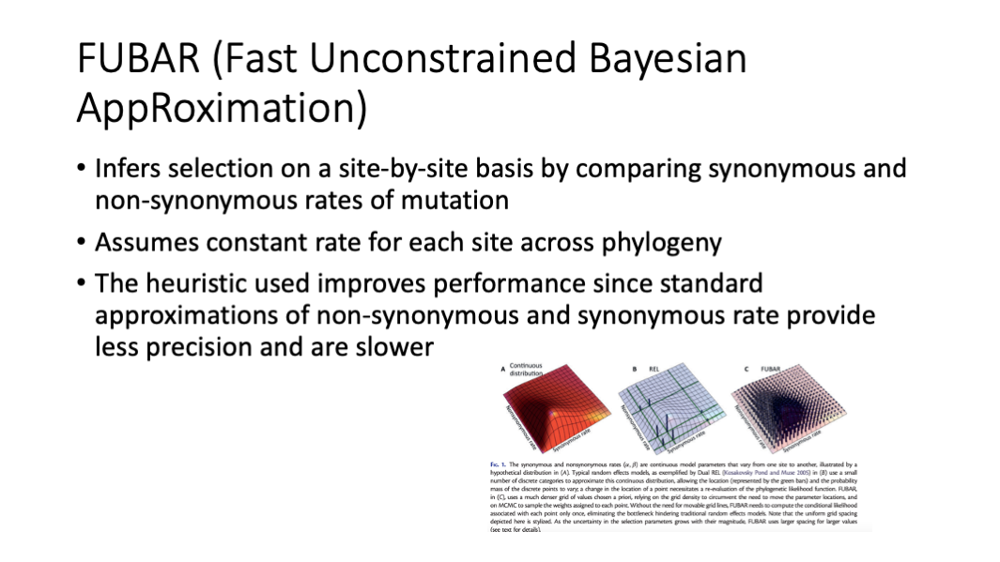

# Project 3: Selection analysis on 293-aa blaKPC genes

<!-- TOC generated with https://ecotrust-canada.github.io/markdown-toc/ -->

## Background

BlaKPC is an important resistance gene to carbapenemases which are a family of
beta-lactamases that are usually used as the last-line of defense to highly
resistant organisms.  The most common blaKPC allele is blaKPC-2, which is a 293
amino acid protein that we find in about 17,000 isolates in the Pathogen
Detection system.  Insertions near the Omega loop are known to affect substrate
binding and phenotype, but to our knowledge publications have not come out
investigating positive selection on amino-acid substitutions in blaKPC.  Here
we look at all the 293-aa blaKPC genes in MicroBIGG-E to see if we can find
sites under positive selection in this enzyme.


Why only 293-aa blaKPC sequences? Basically to make the project simpler. If we
were doing this for a paper we might include all blaKPC sequences, or even add
in other [closely related class-A
carbapenemases](https://www.ncbi.nlm.nih.gov/pathogens/genehierarchy/#bla-A_carba).
But these genes are under heavy selection and some include things like tandem
duplications that tend to confuse multiple sequence aligners. So to do this
right with all the sequences you would need to manually edit the alignment,
keep track of coordinates and deal with other complexities that we don't have
time to go into here.

## Step 1: Get a list of contigs with sequences of interest

### Step 1a: Create a working directory for this project

```shell
mkdir -p ~/project3
cd ~/project3
```

### Step 1b: Use BigQuery to get a list of contigs with KPC genes

Here we use the google command-line interface for BigQuery,
[`bq`](https://cloud.google.com/bigquery/docs/bq-command-line-tool) to run a
query and get the output into a text file.  __Note: You may get an error
message about some configuration that needs to be done. Just run the bq command
a second time and it should work.__

```shell
bq query --use_legacy_sql=false --project asm-ngs-workshop-2022 --max_rows 50000 '
SELECT contig_acc, contig_url, start_on_contig, end_on_contig, strand, element_symbol
FROM `ncbi-pathogen-detect.pdbrowser.microbigge`
WHERE element_symbol LIKE "blaKPC%"
AND element_length = 293
AND amr_method IN ("EXACTX", "EXACTP", "ALLELEX", "ALLELEP", "BLASTX", "BLASTP")
' > 293aa_kpc_contigs.out
```

Lets take a look at the results

```shell
head 293aa_kpc_contigs.out
```

```
+----------------------+----------------------------------------------------------------------------------------------+-----------------+---------------+--------+----------------+
|      contig_acc      |                                          contig_url                                          | start_on_contig | end_on_contig | strand | element_symbol |
+----------------------+----------------------------------------------------------------------------------------------+-----------------+---------------+--------+----------------+
| DAGJCA010000251.1    | gs://ncbi-pathogen-assemblies/Klebsiella/858/709/DAGJCA010000251.1.fna.gz                    |             152 |          1033 | +      | blaKPC         |
| DAGFMJ010000187.1    | gs://ncbi-pathogen-assemblies/Klebsiella/874/735/DAGFMJ010000187.1.fna.gz                    |             308 |          1189 | +      | blaKPC         |
| DAGAHK010000102.1    | gs://ncbi-pathogen-assemblies/Klebsiella/1019/705/DAGAHK010000102.1.fna.gz                   |           10658 |         11539 | +      | blaKPC         |
| DAFWJT010000348.1    | gs://ncbi-pathogen-assemblies/Klebsiella/1141/057/DAFWJT010000348.1.fna.gz                   |             165 |          1046 | +      | blaKPC         |
| DAJACB010000057.1    | gs://ncbi-pathogen-assemblies/Escherichia_coli_Shigella/1386/299/DAJACB010000057.1.fna.gz    |            7204 |          8085 | +      | blaKPC-3       |
| NZ_KL407350.1        | gs://ncbi-pathogen-assemblies/Klebsiella/33/733/NZ_KL407350.1.fna.gz                         |           26561 |         27442 | +      | blaKPC-3       |
| NZ_LAKK01000012.1    | gs://ncbi-pathogen-assemblies/Klebsiella/66/427/NZ_LAKK01000012.1.fna.gz                     |         3087593 |       3088474 | +      | blaKPC-3       |
```

We'll use the fact that the `contig_acc` matches the filename in the contig_url in [Step 3](#step-3-cut-out-coding-sequences) below.

### Step 1c: How many contigs are we looking at?

```shell
wc -l 293aa_kpc_contigs.out
```

```
25849 293aa_kpc_contigs.out
```

Number of lines minus the header and footer 
25,849 - 4 = 25,845 contigs

It's not too large a number so we don't have to worry that much about performance, though we will cut down one of the steps for the purposes of this course. Other parallelized approaches can be used for much larger datasets.

## Step 2: Download contig sequences

<!-- [Alternative instructions for Step 2](Project-3-downloading_contigs) to parallelize the download using `gsutil` and `parallel`. -->

### Step 2a: Download a subset of the sequences

In the interests of exercise time we'll just grab 1% of the contigs using the
`head -n 250` to select the first 250. To get all 25,845 you would remove `|
head -250` from the commandline.

```shell
mkdir contigs
# copy the contig sequences from GS bucket
time fgrep 'gs://' 293aa_kpc_contigs.out | awk '{print $4}' | head -n 250 | gsutil -m cp -I contigs
```
```
...
\ [250/250 files][  2.9 MiB/  2.9 MiB] 100% Done 158.6 KiB/s ETA 00:00:00
Operation completed over 250 objects/2.9 MiB.

real	0m18.748s
user	0m7.983s
sys	0m1.959s
```

This should take under 20 seconds, but if you remove the `head -n 250` to get all 25,800 it will take longer.

### An aside about timing and slow steps

A back of the envelope calculation can be used to estimate how long it will
take (250 contigs / 19 seconds = 13 contigs per second, so 25,000 contigs will
take about 30 minutes)

Below is the end of the output when I ran the same code above for all the contigs. It took 23 minutes to run `time fgrep 'gs://' 293aa_kpc_contigs.out | awk '{print $4}' | head -n 250 | gsutil -m cp -I contigs` so our back-of-the-envelope calculation was about right.

```
...
| [25.8k/25.8k files][329.7 MiB/329.8 MiB]  99% Done 108.2 KiB/s ETA 00:00:01
real		23m16.870s
user		7m57.187s
sys		1m15.007s
```


We'll use [GNU parallel](https://www.gnu.org/software/parallel/) to speed things up a bit. `parallel` will run multiple processes based on what is passed to it on STDIN. Here we split up the list of URLs we need to download into multiple files and run 12 jobs in parallel (which a few rounds of testing downloads on a subset showed me was a reasonably good value).

### Step 2b: Isolate contig URLs

First we isolate just the URLs from the `bq` output

```shell
fgrep 'gs://' 293aa_kpc_contigs.out | awk '{print $4}' > kpc_contig_urls
```

### Step 2c: Split URLs into 12 files

We split up the file into 12 approximately equal parts to run in parallel using [`split`](https://www.man7.org/linux/man-pages/man1/split.1.html).

```shell
split -nl/12 kpc_contig_urls
```

### Step 2c: Download with multiple jobs using `parallel`

Use `parallel` to run 12 jobs at once using the new files created by `split` as input. We're redirecting the output of `gsutil` because it's not particularly useful here (and there is a lot of it).

```shell
mkdir -p contigs
time ls x?? | parallel -j 12 "cat {} | gsutil -m cp -I contigs 2> /dev/null"
```

```
real	2m16.951s
user	15m5.962s
sys	2m10.548s
```

For even larger numbers of contigs running in parallel using an approach like
[Cloud Dataflow](https://cloud.google.com/dataflow/), [Google
Batch](https://cloud.google.com/batch/), or
[Kubernetes](https://cloud.google.com/kubernetes-engine/) clusters could speed
things up. An [earlier version of this exercise](Project-3-batch) used Google
Batch and took about five minutes, but Google Batch is a new "beta" product and
in run-throughs of this workshop it didn't always work so we decided to avoid
it.

## Step 3: Cut out coding sequences

### Step 3a: Reformat FASTA contig identifiers and combine to one file

Here we change the FASTA identifiers to match the `contig_acc` field in the
results of the query instead of the complex FASTA identifiers used by NCBI
FASTA files. This will facilitate downstream processing. Remember in [Step
1b](#step-1b-use-bigquery-to-get-a-list-of-contigs-with-kpc-genes) we noticed
that contig names match the filenames. We'll use that fact below.

What we want to do is run the following command to replace the defline with the
contig identifier so we can use it in the bed file we will create, but for all
of the FASTA files. [`sed`](https://en.wikipedia.org/wiki/Sed) is a common UNIX
command that can apply regular expressions to a file to make the substitution
of the defline.

```shell
zcat contigs/AAGKWB010000023.1.fna.gz | sed "s/^>.*/>AAGKWB010000023.1/" >> contigs.fna
```

We could do it in a shell loop, but it takes 2-3 minutes, so again we'll parallelize 
the process by creating a shell script with the same commands as above and using
[`parallel`](https://www.gnu.org/software/parallel/) to run them in parallel.

```shell
cat <<'END' > rename_contigs.sh
#!/bin/sh

file=$1
contig=`basename $file .fna.gz`
zcat $file | sed "s/^>.*/>$contig/"
END

chmod 755 rename_contigs.sh
time ls contigs/* | parallel -j 8 ./rename_contigs.sh > contigs.fna
```
```

real    1m35.333s
user    2m54.819s
sys     2m20.680s
```

While this is fast enough, if you were really trying to optimize, writing a
little `awk`, `python`, or `perl` script to do the same could be much faster
because it avoids the overhead of running three programs for every file.

### Step 3b: Create BED file of coordinates we want to cut out

In the commands below we're converting our SQL output to BED format. [BED
files](https://en.wikipedia.org/wiki/BED_(file_format)) are in the
tab-delimited format `<contig>` `<start>` `<stop>` `<score>` `<orientation>`...
There are more optional fields in BED files, but we don't need them so we won't
create them.  Note that the BED files use the "half-open zero-based" coordinate
system popularized by the [UCSC genome browsers](https://genome.ucsc.edu/) so
we need to get the coordinates in that format by subtracting 1 from the start
coordinate. [awk](https://en.wikipedia.org/wiki/AWK) is a convenient way to
manipulate delimited files and we'll use it here to parse and manipulate the
output of the `bq` command.

```shell
fgrep 'gs://' 293aa_kpc_contigs.out | awk '{print $2"\t"$6-1"\t"$8"\t"$12"\t1\t"$10}' > kpc_cds.bed
```

### Step 3c: Cut out coding sequence

In this step we use [seqkit](https://bioinf.shenwei.me/seqkit/) to cut out the sequences and reverse complement them (if necessary).

```shell
time cat contigs.fna | seqkit subseq --bed kpc_cds.bed > kpc_cds_all.fna
```

```
[INFO] read BED file ...
[INFO] 25845 BED features loaded

real		0m0.923s
user		0m0.495s
sys		0m0.559s
```

## Step 4: Prepare sequences for selection analysis

Before we start the analysis we're going to clean up our coding sequence file by

1. Removing stop codons
2. Removing duplicate sequences
3. Renaming the sequences to something that will be easier to read as labels on a tree

```shell
cat kpc_cds_all.fna \
    | seqkit subseq -r 1:879 \
    | seqkit rmdup -s -D kpc.duplicate_list \
    | perl -pe 's/>(.*)_.*(blaKPC.*)/>$2_$1/' \
    > kpc_cds.fna
```

How many unique CDS sequences do we have from the starting 25,162?

```shell
fgrep -c '>' kpc_cds.fna
```

```
141
```

## Step 5: Use RAxML to infer a tree

We need a tree to perform the FUBAR selection test below with HyPhy. We're going
to use RAxML-NG because it's fast. RAxML-NG is a maximum-likelihood tree
inference program designed for very large jobs. Note that all sequences are
closely related and the same length so we don't need to perform an alignment
prior to tree inference.


```shell
raxml-ng --search --msa-format FASTA --msa kpc_cds.fna --model GTR+I --seed 1 --redo 
```
```
...

Analysis started: 14-Sep-2022 19:56:43 / finished: 14-Sep-2022 19:58:13

Elapsed time: 89.322 seconds

```


## Step 6: Run FUBAR test with HyPhy

We're going to use [HyPhy](http://hyphy.org/) to perform the [FUBAR](http://www.hyphy.org/w/index.php/FUBAR) (Fast, Unconstrained Bayesian AppRoximation for Inferring Selection) test of [Murrell et al. 2013](http://dx.doi.org/10.1093/molbev/mst030). In addition to running from the command-line as seen below there is a web server for HyPhy at <https://datamonkey.org> and a [GUI interface](http://hyphy.org) to run HyPhy on your own machine. 



```shell
time hyphy fubar --alignment kpc_cds.fna --tree kpc_cds.fna.raxml.bestTree | tee kpc_cds.fubar
```

```
...
### Tabulating site-level results
|     Codon      |   Partition    |     alpha      |      beta      |Posterior prob for positive selection|
|:--------------:|:--------------:|:--------------:|:--------------:|:-----------------------------------:|
|       29       |       1        |        1.017   |        7.247   |       Pos. posterior = 0.9311       |
|      212       |       1        |        0.700   |        6.281   |       Pos. posterior = 0.9117       |
|      239       |       1        |        1.151   |       10.684   |       Pos. posterior = 0.9570       |
----
## FUBAR inferred 3 sites subject to diversifying positive selection at posterior probability >= 0.9
Of these,  0.20 are expected to be false positives (95% confidence interval of 0-1 )


real    0m9.823s
user    1m5.040s
sys     0m0.198s
```

For a more expansive and prettier view of the results of the FUBAR tests you can upload the `kpc_cds.fna.FUBAR.json` created by our run of `hyphy` to <http://vision.hyphy.org/FUBAR>. There are, of course, other tests you might also try such as the Fixed Effects Likelihood test (FEL) e.g.:

```shell
hyphy fel --alignment kpc_cds.fna --tree kpc_cds.fna.raxml.bestTree | tee kpc_cds.fel
```

## Discussion

[Galdadas et al. 2018](https://www.ncbi.nlm.nih.gov/pmc/articles/PMC6110804/) investigates the structure of blaKPC-2 and looks at important residues. Position 239 occurs immediately next to [the conserved disulfide bond position 238 and is close to the binding pocket](https://www.ncbi.nlm.nih.gov/Structure/pdb/5UJ3) (Fig. 4 in [Li et al. 2021](https://www.ncbi.nlm.nih.gov/pmc/articles/PMC8415713/) also describes the importance of position 239).  When we examine the phenotypes of known KPC alleles that have been functionally characterized in the literature, those KPC alleles of length 293 aa with valine at position 239 are described as inhibitor-resistant. This suggests, though it obviously would need further experimental confirmation, that changes at position 239 could alter inhibitor-resistance. Unfortunately, there are no characterized alleles with a length of 293 aa that have any variability at position 212 (all of the variation is found in undescribed and unnamed alleles), so it is unclear what the biological importance of that site might be so that might be a good site to explore experimentally.

We ran this analysis with all 25,000 contigs containing 293-aa blaKPC genes and the slowest step is grabbing and copying the sequences from the google storage bucket which took about 22 minutes for 25,000 sequences. If we wanted to do something similar with a larger set of contigs, say those that contain blaTEM genes (~193,000 contigs) you might want to use a Kubernetes cluster or Google Cloud Dataproc to extract the coding sequences in parallel and deduplicate them. 

-------------------------------------------
## End of Project 3

## Cleanup

Once you are done please shutdown your VM by going to the VM instances console, clicking on the three dots next to your VM and clicking Stop. 


