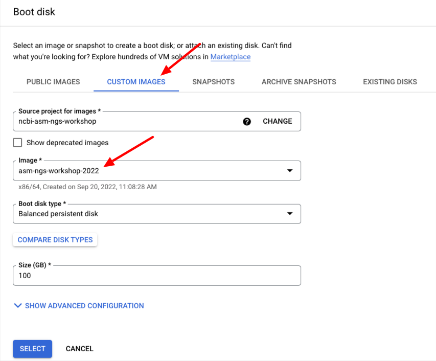

A few basic things need to be set up before we can get to the actual work. In the interests of time and speed we have setup a You'll need to create and start a VM based on a snapshot we provide that has a lot of bioinformatics software pre-installed. As you know getting bioinformatics software installed is often a time-consuming task that we have done for you.

### Open an "Incognito window"

Go to <https://console.cloud.google.com/compute/instances?project=ncbi-asm-ngs-workshop>

### Log in

Log in using the email address and credentials you should have been emailed.

### Select project *asm-ngs-workshop-2022*


### Create a VM based on the asm-ngs-workshop-2022 image.

Go to Compute Engine->Virtual Machines -> VM Instances

_________________________________________________________


_________________________________________________________

Use the name "asm-ngs-$USER" with $USER replaced with your username


_________________________________________________________

Set Region to "us-cental1 (Iowa)" and Zone to "us-cental1a"


_________________________________________________________

In Machine Configuration, set to "e2-standard-8"


_________________________________________________________

Change the standard Boot Disk by clicking on the Change button


_________________________________________________________

Go to Custom Images and choose the "asm-ngs-workshop-2022" image and then hit the select button at the bottom.



_________________________________________________________

Set allow full Access to all Cloud APIs and allow HTTPs traffic and then hit the Create button at the bottom


_________________________________________________________

### Log into your new VM


_________________________________________________________

It will take a few minutes to create the new VM. Once it is running click the __SSH__ button to the right of the VM list.

_________________________________________________________

It may take a few moments to make the connection, transfer SSH keys, etc.


_________________________________________________________

If you successfully login you should be in the terminal and able to type commands in


_________________________________________________________

<!-- 
### Configure SRA toolkit

Now you need to configure the sra-toolkit. 

```
vdb-config -i
```
_________________________________________________________

Make sure the Enable remote access is configured (should have an X in the parentheses)

_________________________________________________________

_________________________________________________________

M for main
E to Enable remote access
G for GCP configuration
r for report instance identity
s for save
x for exit

-->

### Authorize your VM to use google utilities

To use google cloud utilities you will need to give permissions to the google cloud tools access to your account. The following command gives the VM full access. We're doing this for simplicity in this workshop; you may want to grant more limited permissions you grant for your own work. 

Paste in the following command and follow the instructions. 


```bash
gcloud auth login
```

Note you will have to accept some scary warnings and copy and paste a string back into the ssh window.


_______________________

<!--

### Create a Cloud Storage Bucket for the workshop 

```bash
gsutil mb gs://asmngs-$USER
```


_________________________________________________________


### Make sure your environment is up to date for the workshop

```bash
cp -r /etc/skel/.??* /etc/skel/* ~/
source ~/.bashrc
```
-->

## Install necessary software

### First update and install some standard software

```bash
sudo apt-get update
sudo apt-get -y install git unzip parallel
```

### Compilers and associated software

```bash
sudo apt-get -y install build-essential
```

### RAxML-NG

<https://github.com/amkozlov/raxml-ng/wiki>

```bash
mkdir -p src/raxml
cd src/raxml
wget https://github.com/amkozlov/raxml-ng/releases/download/1.1.0/raxml-ng_v1.1.0_linux_x86_64.zip
unzip raxml-ng_v1.1.0_linux_x86_64.zip
sudo cp raxml-ng /usr/local/bin
```

### SeqKit

<https://bioinf.shenwei.me/seqkit/>

```bash
mkdir ~/src/seqkit
pushd ~/src/seqkit
wget https://github.com/shenwei356/seqkit/releases/download/v2.3.0/seqkit_linux_amd64.tar.gz
tar xvfz seqkit_linux_amd64.tar.gz
sudo cp seqkit /usr/local/bin
```

### Muscle

<https://drive5.com/muscle5/>

```bash
pushd ~/src
wget https://github.com/rcedgar/muscle/releases/download/v5.1/muscle5.1.linux_intel64
chmod 755  muscle5.1.linux_intel64
sudo mv muscle5.1.linux_intel64 /usr/local/bin
pushd /usr/local/bin
    sudo ln -s muscle5.1.linux_intel64 muscle
popd
```

### HyPhy

<http://www.hyphy.org/>

```bash
sudo apt-get install -y cmake libcurl4-openssl-dev curl zlib1g
cd ~/src
git clone https://github.com/veg/hyphy.git
cd hyphy
cmake .
make -j MP
sudo make install
```

### Small modifications to startup scripts

```bash
cat <<END >> ~/.bashrc
export HISTCONTROL=ignoredups
alias ll='ls -ltrF'
export PATH=$PATH:/snap/bin:/usr/local/bin
# set PATH so it includes user's private bin if it exists
if [ -d "$HOME/bin" ] ; then
    PATH="$HOME/bin:$PATH"
fi

# set PATH so it includes user's private bin if it exists
if [ -d "$HOME/.local/bin" ] ; then
    PATH="$HOME/.local/bin:$PATH"
fi
END
. ~/.bashrc
```

## Your setup should be done 

[Continue to Project 2](Project-2.md)

