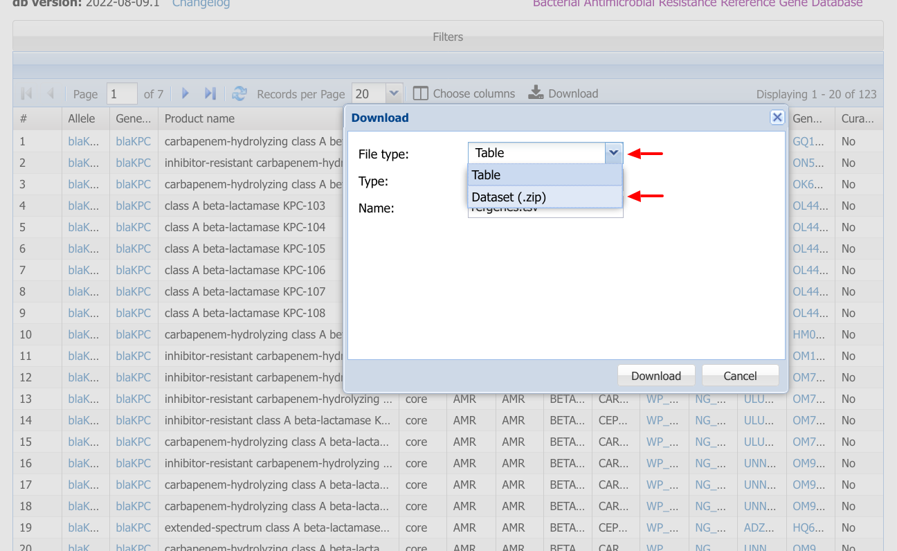
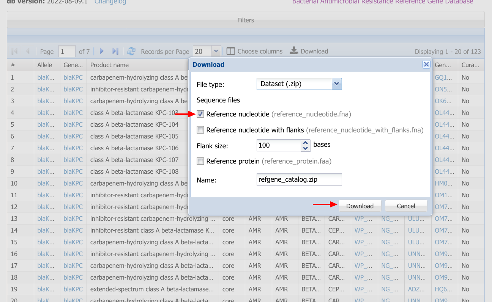

Project 4: Generate tree of KPC alleles to examine evolution of size variants
=============================================================================

Adaped from https://confluence.ncbi.nlm.nih.gov/display/PD/KPC+family+phylogeny

## Step 1: Download FASTA file of all blaKPC alleles from the Reference Gene Catalog

### Step 1a: Make a working directory
```
mkdir -p ~/project4
cd ~/project4
```

### Step 1b: Use your web browser to search for KPC alleles in the Reference Gene Catalog

Go to https://www.ncbi.nlm.nih.gov/pathogens/refgene/ and search for `blaKPC*`.


[Direct link](https://www.ncbi.nlm.nih.gov/pathogens/refgene/#blaKPC*)

### Step 1c: Download FASTA file of reference coding sequences

Click "Download" and select "__File type: Dataset__".



Then make sure "__Reference nucleotide__" is selected and click Download.



### Step 1d: Upload the datasets file to the VM

#### Need to be able to use web SSH client to write this part

### Step 1e: Uncompress the datasets package and extract the FASTA file

```
unzip refgene_catalog.zip
mv ncbi_dataset/data/nucleotide.fna ./kpc_cds.fna
```

## Step 2: Filter for sequences less than 297 amino-acids in length

There are a few KPC alleles with large insertions that we will exclude in this analysis to simplify demonstrationa and analysis.

### Step 2a: Download the Reference Gene Catalog table

The data behind the [Reference Gene Catalog](https://www.ncbi.nlm.nih.gov/pathogens/refgene/) is available on our FTP site at <https://ftp.ncbi.nlm.nih.gov/pathogen/Antimicrobial_resistance/AMRFinderPlus/database/latest/ReferenceGeneCatalog.txt>. 

```
wget https://ftp.ncbi.nlm.nih.gov/pathogen/Antimicrobial_resistance/AMRFinderPlus/database/latest/ReferenceGeneCatalog.txt
```

### Step 2b: Get a list of blaKPC genes < 281 amino-acids in length

We'll use `awk` to calculate the length of each element in nucleotide space and filter for those less than 297 amino acids (`genbank_stop` - `genbank_start` + 1 < 297).  For those lines that match we'll print out the `refseq_accession`, `allele`, and the length in amino-acids.

```
awk -F'\t' '$2 == "blaKPC" && ($17-$16+1)/3 < 297 { print $11"\t"$1"\t"($17-$16+1)/3 }' ReferenceGeneCatalog.txt > kpc_to_analyze.tab
```

`kpc_to_analyze.tab` is in the format `accession` \<tab\> `allele` \<tab\> `length`

### Step 2c: Filter and reformat the FASTA file

Filter the FASTA file for the sequences we're interested in and make convenient phylip-compatible names for visualizing on a phylogenetic tree.

```
while read -u 10 accession allele length
do
    seqkit grep -r -p "$accession" kpc_cds.fna | 
        sed "s/^>.*/>${accession}_${allele}_${length}/"
done 10< kpc_to_analyze.tab > kpc_to_analyze.fna
```

## Step 3: Align the sequences with Muscle

```
muscle -align kpc_to_analyze.fna -output kpc_to_analyze.aln.fna
```
This step should take a couple of minutes.


## Step 4: Infer the tree using RAxML

```
raxml-ng --search --msa kpc_to_analyze.aln.fna --tree rand{20},pars{20} --model GTR+I+G --redo
```

## Step 5: Visualize the tree in iTOL

### Step 5a: Download your tree file

__NEED WEB SSH INTERFACE TO WRITE INSTRUCTIONS HERE__

### Step 5b: Upload your tree to visualize
Go to iTOL at https://itol.embl.de/upload.cgi and upload your tree to visualize.

__Maybe just have them copy and paste it into the box__ Need to see how it works/looks from the web ssh client.

