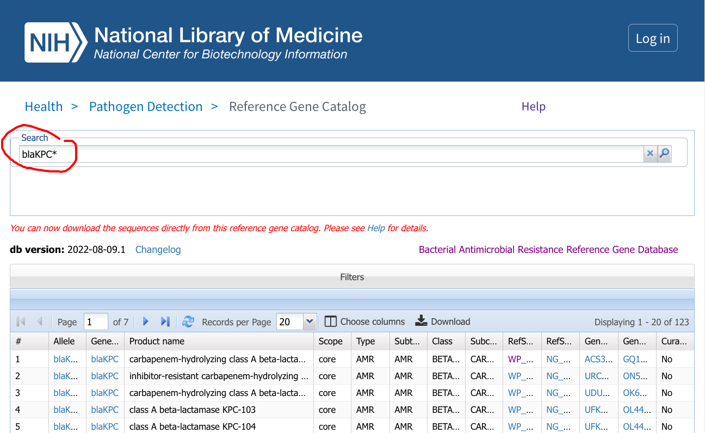

Project 4: Generate tree of KPC alleles to examine evolution of size variants
=============================================================================

Adaped from https://confluence.ncbi.nlm.nih.gov/display/PD/KPC+family+phylogeny

## Step 1: Download FASTA file of all blaKPC alleles from the Reference Gene Catalog

### Step 1a: Make a working directory
```
mkdir -p ~/project2
cd ~/project2
```

### Step 1b: Use your web browser to search for KPC alleles in the Reference Gene Catalog

Go to https://www.ncbi.nlm.nih.gov/pathogens/refgene/ and search for `blaKPC*`.



[Direct link](https://www.ncbi.nlm.nih.gov/pathogens/refgene/#blaKPC*)

### Step 1c: Download FASTA file of reference coding sequences

Click "Download"


