# Comparison of genotype to phenoptye for a set of isolates

We're going to examine a set of _Acinetobacter_ from [Cartography of opportunistic pathogens and antibiotic resistance genes in a tertiary hospital environment](https://www.nature.com/articles/s41591-020-0894-4/email/correspondent/c1/) that have phenotypes listed in Supplementary Data from the paper.

These isolates were sequence, but the assemblies were not deposited in GenBank, so we're going to assemble them from reads using SKESA, search for AMR genes using AMRFinderPlus, predict phenotype from genotype based on AMRFinderPlus results, and compare the predictions with the measured phenotypes from the paper.

__Table of Contents__

  + [Format of these exercises](#format-of-these-exercises)
  + [Step 1](#step-1-get-the-data): Get the data
    - [Step 1a](#step-1a-identify-the-accessions-for-the-phenotyped-acinetobacter-baumannii): Identify the accessions for the phenotyped _Acinetobacter baumannii_
    - [Step 1b](#step-1b-download-the-sequences): Download the sequences
  + [Step 2](#step-2-assemble-isolates-using-skesa): Assemble isolates using SKESA
    - [Step 2a](#step-2a-create-a-working-directory): Create a working directory
    - [Step 2b](#step-2b-link-in-the-sample-accession-file-from-the-previous-step): Link in the sample accession file from the previous step
    - [Step 2c](#step-2c-create-the-submit_listtsv-file-which-is-used-to-tell-dsub-what-parameters-to-parallelize): Create the submit_list.tsv file which is used to tell `dsub` what parameters to parallelize
    - [Step 2d](#step-2d-create-the-dsub-command-to-perform-the-assembly): Create the dsub command to perform the assembly
    - [Step 2e](#step-2e-run-the-assembly-command): Run the assembly command
    - [Step 2f](#step-2f-copy-the-assemblies-you-just-made-from-the-bucket-to-your-vm-disk): Copy the assemblies you just made from the bucket to your VM disk
    - [Step 2g](#step-2g-in-the-interests-of-time-we-have-pre-computed-the-rest-of-the-assemblies): In the interests of time we have pre-computed the rest of the assemblies.
  + [Step 3](#step-3-run-amrfinderplus-on-the-assemblies): Run AMRFinderPlus on the assemblies
    - [Step 3a](#step-3a--create-directories): Create directories
    - [Step 3b](#step-3b-create-the-submit_listtsv-file): Create the submit_list.tsv file
    - [Step 3c](#step-3c-create-the-dsub-command): Create the dsub command
    - [Step 3d](#step-3d-run-dsub): Run dsub
    - [Step 3e](#step-3e-copy-amrfinder-files-from-bucket-to-local-disk): Copy amrfinder files from bucket to local disk
    - [Step 3f](#step-3f-copy-pre-computed-results-for-the-rest-of-the-samples): Copy pre-computed results for the rest of the samples
  + [Step 4](#step-4-get-resistance-phenotypes-from-paper): Get resistance phenotypes from paper
    - [Step 4a](#step-4a-create-working-directory): Create working directory
    - [Step 4b](#step-4b-get-spreadsheet-data): Get spreadsheet data
    - [Step 4c](#step-4c-convert-data-to-tidy-format): Convert data to "tidy" format
    - [Step 4d](#step-4d-take-a-look-at-the-data): Take a look at the data
  + [Step 5](#step-5-amr-genotype-to-phenotype-prediction): AMR genotype to phenotype prediction
    - [Step 5a](#step-5a-set-up-directory-and-get-script): Set up directory and get script
    - [Step 5b](#step-5b-convert-amrfinderplus-output-files-to-phenotypic-predictions): Convert AMRFinderPlus output files to phenotypic predictions
  + [Step 6](#step-6-identify-discrepancies-between-predicted-and-measured-phenotype): Identify discrepancies between predicted and measured phenotype
    - [Step 6a](#step-6a-make-working-directories): Make working directories
    - [Step 6b](#step-6b-merge-tables): Merge tables
    - [Step 6c](#step-6c-find-disagreements): Find disagreements
  + [Step 7](#step-7-discuss-findings): Discuss findings
    - [Step 7a](https://github.com/NCBI-Codeathons/asm-ngs-workshop/wiki/Project-1#step-7a): Look at a particular AMRFinder result
    - [Step 7b](https://github.com/NCBI-Codeathons/asm-ngs-workshop/wiki/Project-1#step-7b): Look at a particular disagreement


### Format of these exercises

In general what you see in code blocks should be copied and pasted into the terminal window. E.g.:
```bash
# For example, you should copy and paste all of this into your terminal window
echo "Hi $USER"
```

### Step 1: Get the data

#### Step 1a: Identify the accessions for the phenotyped _Acinetobacter baumannii_

We've done this task for you because it is complex, time consuming, and illustrates a problem with the way data is included from many papers today. Little thought is given to how the data can be accessed even when it is "publicly available".  To get the dataset to do further analysis, here's what we did [Project 1: Get IDs](/pages-test/pd-project1/get_ids). You will just copy the processed list of accessions into a work directory

```bash
mkdir -p ~/project1/step1
cd ~/project1/step1
    gsutil cp gs://asm-ngs/project1/step1/singapore_samples_srafull.txt ~/project1/step1
```
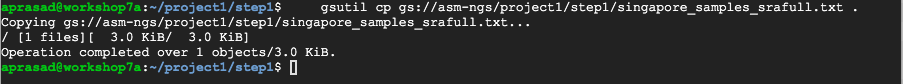

#### Step 1b: Download the sequences

In the interests of time we will only download two of them, but just remove the `| head -2` portion of the command below to download the full set of 105 FASTQ files listed in `singapore_samples_srafull.txt`

```bash
mkdir fastq

for acc in `cut -f 3 singapore_samples_srafull.txt | head -2`
do 
    prefetch $acc 
    fasterq-dump $acc -O fastq
done
```
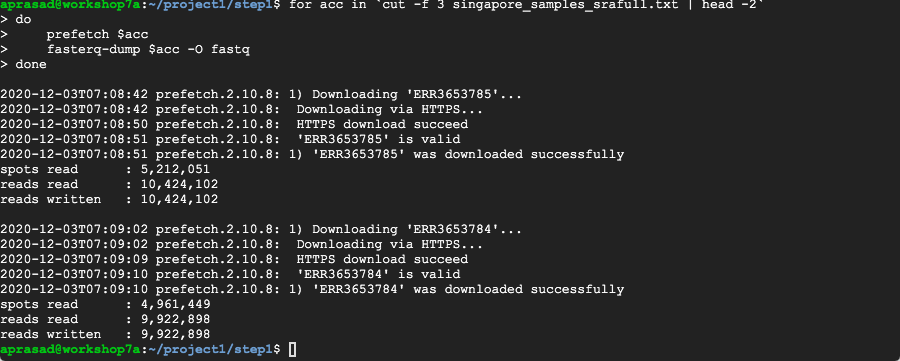


Notice that the `prefetch` created a directory for each accession with a special SRA formatted file in it. `fasterq-dump` then extracts the sequences in fastq format from that file. 

### Step 2: Assemble isolates using SKESA

We've used [SKESA](https://github.com/ncbi/skesa) to assemble the isolates
because it is a fast and high-accuracy assembler. You could use another, more
thorough assembler such as SPAdes to gain some additional sequence, but at the
cost of some time, accuracy, and expense.

We're going to set you up to do an assembly in parallel using
[dsub](https://github.com/DataBiosphere/dsub). In the interests of saving some
time we'll set up for computation of just two assemblies, but the same setup
was used to assemble all 105 genomes from the paper.

#### Step 2a: Create a working directory

```bash
mkdir -p ~/project1/step2
cd ~/project1/step2
```

#### Step 2b: Link in the sample accession file from the previous step
```bash
# Link in the sample accession file (from the previous step)
ln -s ../step1/singapore_samples_srafull.txt
```

#### Step 2c: Create the submit_list.tsv file which is used to tell `dsub` what parameters to parallelize

```bash
# Get a small script to create the submit_list.tsv file for dsub
curl -O https://raw.githubusercontent.com/NCBI-Codeathons/asm-ngs-workshop/main/project1/create_submit_list.sh
bash create_submit_list.sh > submit_list.tsv
```

```bash
# For the workshop we want to just run two assemblies
head -3 submit_list.tsv > submit_list_two.tsv 
cat submit_list_two.tsv
```
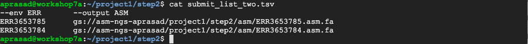

#### Step 2d: Create the dsub command to perform the assembly
```bash
    # The assembly command. I like to create a script for easier editing and record-keeping, but you could type this on the commandline
cat > assemble <<'END'
dsub \
  --provider google-cls-v2 \
  --project asm-ngs-workshop \
  --regions us-central1 \
  --logging gs://asm-ngs-$USER/project1/step2/logs \
  --image staphb/skesa \
  --tasks submit_list_two.tsv \
  --command   'skesa --sra_run ${ERR} --contigs_out ${ASM} --cores 6 ' \
  --min-ram 24 \
  --min-cores 6 \
  --subnetwork default \
  --wait
END
```

#### Step 2e: Run the assembly command
```bash
# Run the assemblies in parallel on new VMs using dsub
time bash -x assemble
# You should see new VMs created and running in the VM instances list
```

You should have to wait 10-15 minutes for this to finish. You might want to open a new SSH window and run the status check command (see the output of dsub)

This is what you should see if your job as successfully started:
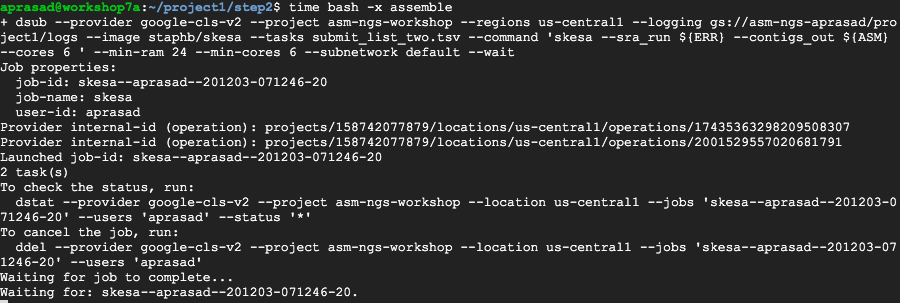


Once it is complete (10-15 minutes later) you should see the following if it was successful:
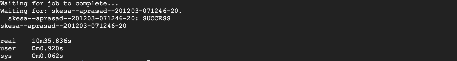

_____________
SHOW SLIDES
_____________


##### Submit lists for `dsub`

Your submit_list.tsv should be in the following tab-delimited format
```
cat submit_list_two.tsv
```
```
--env ERR	--output ASM
ERR3653785	gs://asm-ngs-feldgard/project1/step2/asm/ERR3653785.asm.fa
ERR3653784	gs://asm-ngs-feldgard/project1/step2/asm/ERR3653784.asm.fa
```

There are three types of columns in the dsub "submit lists"
`--env <NAME>` sets an enviornment variable
`--input <NAME>` sets an environment variable with a path to an input file
`--output <NAME>` sets an environment variable with a path to an output file

So to read from the SRA files you downloaded you might create a submit list that looks like:

```
--input READ1  --input READ2	--output ASM
gs://asm-ngs-feldgard/project1/step1/fastq/ERR3653785_1.fastq	gs://asm-ngs-feldgard/project1/step1/fastq/ERR3653785_2.fastq	gs://asm-ngs-feldgard/project1/step2/asm/ERR3653785.asm.fa
```


#### Step 2f: Copy the assemblies you just made from the bucket to your VM disk

Once the assemblies are done we're ready to move on.

```bash
# copy the assemblies from the bucket onto your local disk.
mkdir ~/project1/step2/asm
gsutil -m cp gs://asm-ngs-$USER/project1/step2/asm/* ~/project1/step2/asm/
```

#### You should now be able to see the FASTA assemblies you just created. 
```bash
ls -l asm/*
```
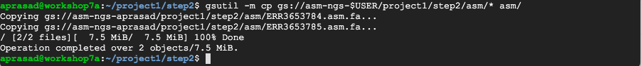

#### Step 2g: In the interests of time we have pre-computed the rest of the assemblies. 

```bash
# copy pre-computed assemblies
gsutil -m cp -r gs://asm-ngs/project1/step2/asm ~/project1/step2/
```


### Step 3: Run AMRFinderPlus on the assemblies

[AMRFinderPlus](https://github.com/ncbi/amr/wiki) is a program that searches for antimicrobial resistance (AMR) genes and point mutations plus additional virulence and stress response genes. We're going to use AMRFinderPlus to try to predict the phenotype for these _Acinetobacter_ runs based on the genome assemblies we generated.

As we did for the assemblies we're just going to run two, but by changing `submit_list_two.tsv` to `submit_list.tsv` you can run AMRFinderPlus on all of the assemblies.

#### Step 3a:  Create directories
```bash
mkdir ~/project1/step3
cd ~/project1/step3
```

#### Step 3b: Create the submit_list.tsv file
```bash
echo $'--input ASM\t--output AMR' > submit_list.tsv
for asm in `gsutil ls gs://asm-ngs/project1/step2/asm`
do
    acc=`basename $asm .asm.fa`
    echo $asm$'\t'"gs://asm-ngs-$USER/project1/step3/amrfinder/$acc.amrfinder"
done >> submit_list.tsv

# just run two jobs in parallel
head -3 submit_list.tsv > submit_list_two.tsv
```

Now check your `submit_list_two.tsv`

```bash
cat submit_list_two.tsv
```
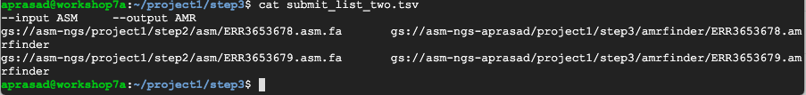


#### Step 3c: Create the dsub command
```bash
cat > run_amrfinder <<'END'
dsub \
  --provider google-cls-v2 \
  --project asm-ngs-workshop \
  --regions us-central1 \
  --logging gs://asm-ngs-$USER/project1/step3/logs \
  --image staphb/ncbi-amrfinderplus \
  --tasks submit_list_two.tsv \
  --command   'amrfinder --plus -O Acinetobacter_baumannii -n ${ASM} -o ${AMR}' \
  --min-ram 3 \
  --min-cores 2 \
  --name amrfinder \
  --subnetwork default \
  --wait
END
```

#### Step 3d: Run dsub
```bash
time bash -x run_amrfinder 
```
When you start the dsub successfully it should look something like:
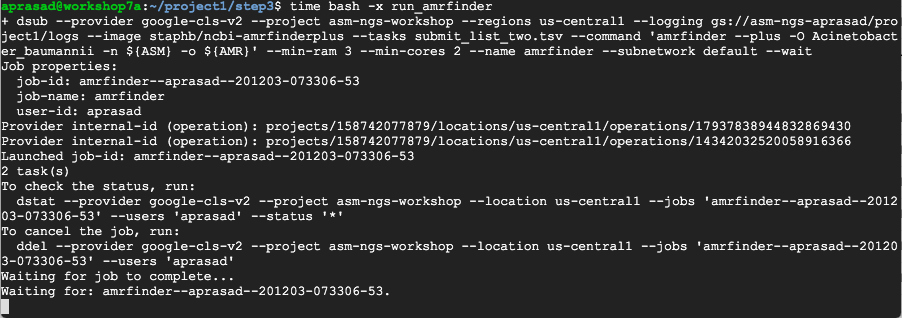

This run of AMRFinderPlus should take 5-10 minutes. When the job has finished you should get a "SUCCESS" message like:
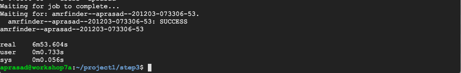

________________
SHOW SLIDES
________________

#### Step 3e: Copy amrfinder files from bucket to local disk

```bash
gsutil -m cp -r gs://asm-ngs-$USER/project1/step3/amrfinder ~/project1/step3
```
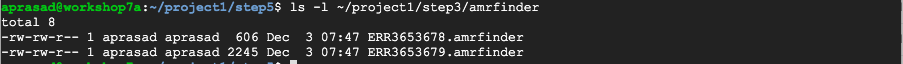


##### You should now see the amrfinder results in ~/project1/step3/amrfinder
```bash
ls -l ~/project1/step3/amrfinder
```

#### Step 3f: Copy pre-computed results for the rest of the samples
```bash
gsutil -m cp -r gs://asm-ngs/project1/step3/amrfinder ~/project1/step3
```
### Step 4: Get resistance phenotypes from paper

We have written a short script to go from the "A. baumannii" tab of [Supplementary Table 6](https://static-content.springer.com/esm/art%3A10.1038%2Fs41591-020-0894-4/MediaObjects/41591_2020_894_MOESM8_ESM.xlsx) from the paper to an easy to work with "tidy" data format. We have already converted the Excel spreadsheet to tab-delimited format by copying and pasting it into a text file.

#### Step 4a: Create working directory
```bash
mkdir ~/project1/step4
cd ~/project1/step4
```

#### Step 4b: Get spreadsheet data
```bash
# get data
curl -O https://raw.githubusercontent.com/evolarjun/workshop/main/project1/spreadsheet-phenotypes.tab
```
What does the spreadsheet data look like?

```bash
head spreadsheet-phenotypes.tab | d2f
```
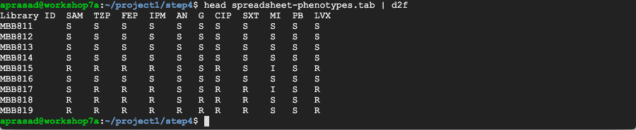

#### Step 4c: Convert data to "tidy" format
```bash
# get conversion script
curl -O https://raw.githubusercontent.com/evolarjun/workshop/main/project1/spreadsheet2tidy.pl

# run conversion
perl spreadsheet2tidy.pl > spreadsheet-phenotypes.tidy.tab
```
#### Step 4d: Take a look at the data

```bash
head spreadsheet-phenotypes.tidy.tab
```
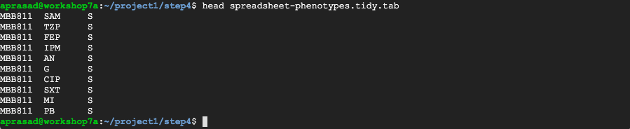


### Step 5: AMR genotype to phenotype prediction

This step is not trivial for many taxa. For some drugs especially, _Acinetobacter baumannii_ is particularly difficult. For Acinetobacter we have codified what we do know in a small script, but even then, the presence of chromosomal carbapenemases and efflux pumps complicates interpretation.

We wrote a short script to go from [AMRFinderPlus reports](https://github.com/ncbi/amr/wiki/Running-AMRFinderPlus#output-format) to predictions of resistance. Note that chromosomal efflux pumps and beta-lactamases play a big role in resistance in Acinetobacter, but it is not well understood which variants affect resistance. For that reason we are not predicting resistance based on efflux pumps, and the presence of beta-lactamases with known resistance profiles may not cause phenotypic resistance. 

Note: This small prediction script was created just for this exercise and should not be relied upon to predict phenotypes in any other context, especially not a clinical one.

#### Step 5a: Set up directory and get script
```bash
mkdir ~/project1/step5
cd ~/project1/step5

# link in data from other steps
ln -s ../step4/spreadsheet-phenotypes.tidy.tab .
ln -s ../step3/amrfinder .
ln -s ../step1/singapore_samples_srafull.txt .

# get script to convert AMRFinderPlus results to phenotype predictions for comparison
curl -O https://raw.githubusercontent.com/NCBI-Codeathons/asm-ngs-workshop/main/project1/acinetobacter_amrfinder2phenotype.pl
curl -O https://raw.githubusercontent.com/NCBI-Codeathons/asm-ngs-workshop/main/project1/subclass2phenotype.tab
chmod 755 acinetobacter_amrfinder2phenotype.pl
```

#### Step 5b: Convert AMRFinderPlus output files to phenotypic predictions

```bash
for file in amrfinder/*.amrfinder
do
    base=`basename $file .amrfinder`
    ./acinetobacter_amrfinder2phenotype.pl $base $file
done > predicted-phenotypes.tab
```

Check on the predicted phenotypes:
```bash
head predicted-phenotypes.tab
```
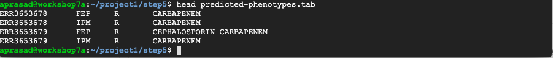

### Step 6: Identify discrepancies between predicted and measured phenotype

#### Step 6a: Make working directories
```bash
mkdir ~/project1/step6
cd ~/project1/step6
```

#### Step 6b: Merge tables
The paper uses identifiers instead of accessions for the phenotypes, so we need to link the SRA accessions associated with the AMRFinderPlus results with the identifiers from the supplementary data. We created this linkage in step 1 so we can use it here.

```bash
    
# link in files from previous steps
ln -s ../step5/predicted-phenotypes.tab . 
ln -s ../step4/spreadsheet-phenotypes.tidy.tab .
ln -s ../step1/singapore_samples_srafull.txt .
    
# Merge tables using 'q' (https://github.com/harelba/q/)
cat > merge_query.sql <<END
select trans.c1 samplename, trans.c3 accession, pheno.c2 drug, pheno.c3 phenotype,
       pred.c3 predicted, pred.c4 reason
  from spreadsheet-phenotypes.tidy.tab pheno
  join singapore_samples_srafull.txt trans
    on pheno.c1 = trans.c1
  left join predicted-phenotypes.tab pred
    on pred.c1 = trans.c3
   and pred.c2 = pheno.c2
END
q -t -T -O -q merge_query.sql | awk 'BEGIN {IFS=OFS="\t"} { sub(/^$/, "S", $5)} 1' > all_phenotypes_predictions.tab
```
Check on the merged phenotype and genotype prediction table:
```bash
head all_phenotypes_predictions.tab
```

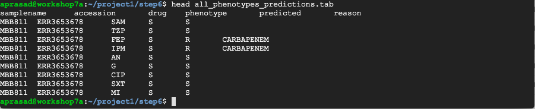

#### Step 6c: Find disagreements
```bash
# find disagreements
awk '$4 != $5 && !($4 == "I" && $5 == "R") { print }' all_phenotypes_predictions.tab > disagreements.tab
```
Take a look at the disagreements file
```bash
d2f disagreements.tab | head
```
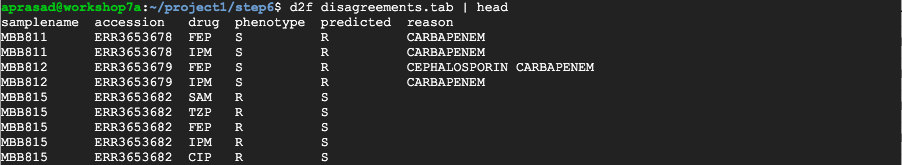

### Step 7: Discuss findings

####  Step 7a
Look at a particular AMRFinder Results
```
grep BETA-LACTAM ~/project1/step5/amrfinder/ERR3653785.amrfinder

```


####  Step 7b
Look at a particular disagreement
```
grep ERR3653785 ~/project1/step6/disagreements.tab
```


___________
SHOW SLIDES
___________


Next: [Project 2](/pages-test/pd-project2)

